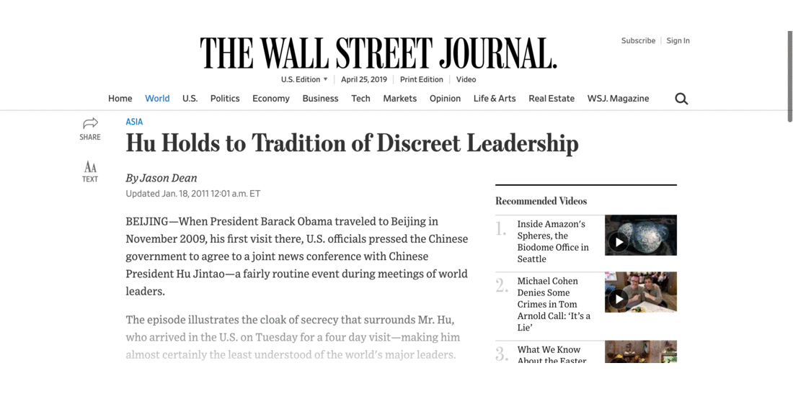
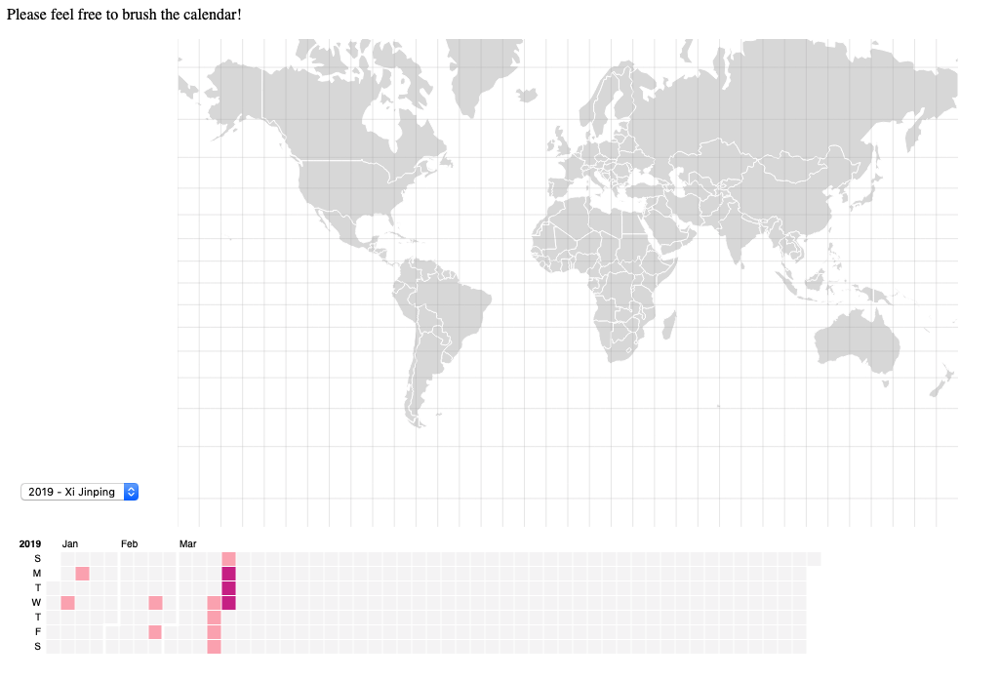
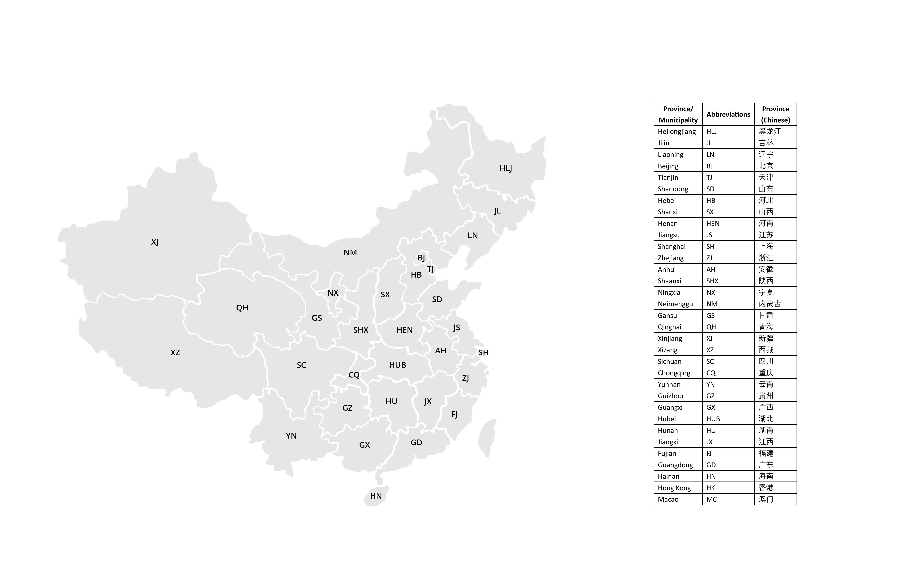
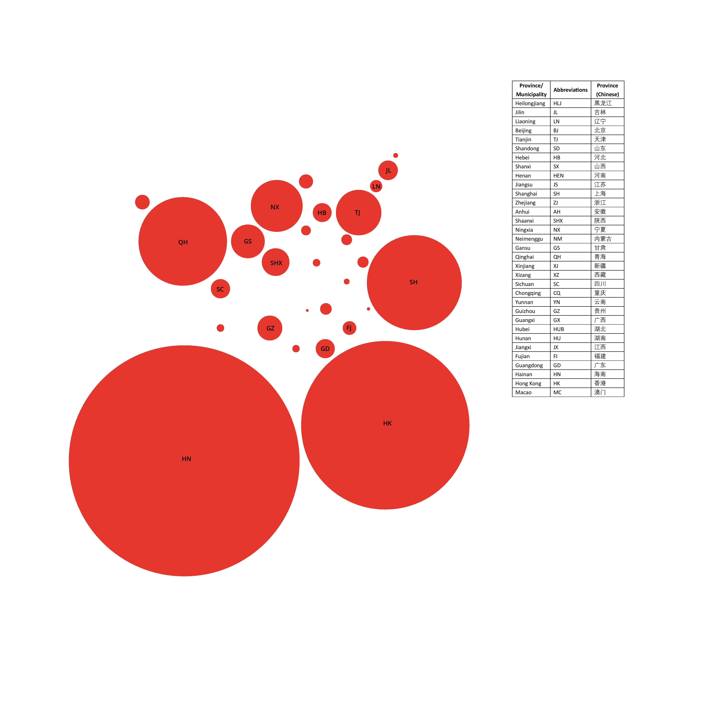
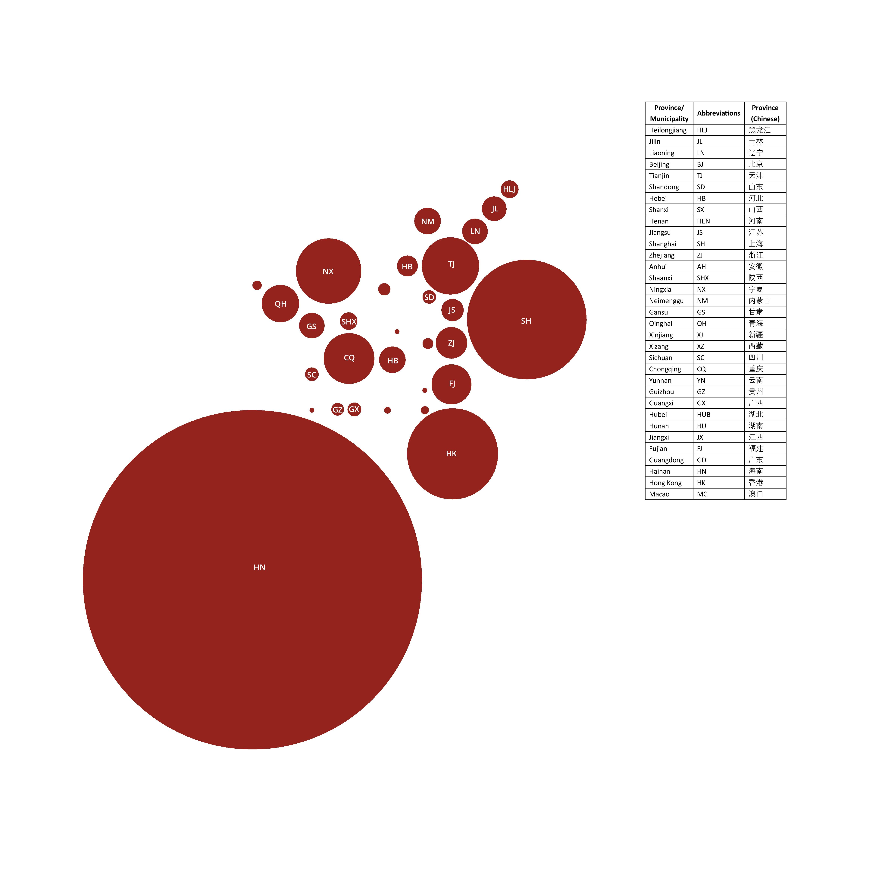

<style>
body {
text-align: justify}
</style>

```{r setup, include=FALSE}
knitr::opts_chunk$set(echo = FALSE)
library(prettydoc)
library(htmltools)
library(vembedr)
library(r2d3)
library(shiny)
library(rvest)
library(tidyverse)
library(kableExtra)
library(stringr)
library(xml2)
library(httr)
library(dplyr)
library(data.table)
library(DT)
library(rowr)
library(maps)
```

<center>

</center>


## The Context
Since Xi took the reins of power in 2013, analysts have argued that there has been a marked shift in China's assertiveness. These include [China's launch of the Belt and Road Initiative](https://www.nytimes.com/interactive/2018/11/18/world/asia/world-built-by-china.html), [its involved participation in the United Nations](https://www.theguardian.com/world/2018/sep/24/china-starts-to-assert-its-world-view-at-un-as-influence-grows) and [its willingness to contemplate a trade war with the United States](https://www.scmp.com/economy/china-economy/article/2165860/xi-jinping-says-trade-war-pushes-china-rely-itself-and-thats). This comes against a backdrop of a [domestic economy that has had structural problems](https://asia.nikkei.com/Opinion/Nikkei-Editorial/The-problems-facing-China-s-healthy-economy), [a flurry of new domestic initiatives](https://www.washingtonpost.com/business/chinas-two-child-policy/2018/06/06/05d13f54-69bf-11e8-a335-c4503d041eaf_story.html?utm_term=.7c4c61699238) and an unprecedented battle against [systemic corruption](https://chinapower.csis.org/can-xi-jinpings-anti-corruption-campaign-succeed/).

<center>
```{r fig.align='center'}
embed_url("https://www.youtube.com/watch?v=T54fUAuGQy4")
```
</center>

This contrasts to the term of the previous president, Hu Jintao, which was arguably [more concilliatory and decentralised](https://thediplomat.com/2017/10/speaking-up-for-yesterdays-man-remembering-hu-jintao/). 

**How true is this? How can we go about answering this? **

## Our question: Can travel patterns reveal shifting governance styles of Chinese presidents?

Our initial question, which was arguably too broad to be conducive to a shorter-term project, has been reframed and now explores two types of data with the help of China Vitae's [travel profiles](http://www.chinavitae.com/vip/index.php?mode=events&type=cv&id=19&filter_year=2011): 

1. International travel history of Hu and Xi
2. Domestic travel history of Hu and Xi

## Biography: Charting their rise to the top

```{r}
htmltools::includeHTML("index1.html")
```

Simply scroll over the circle in a clockwise direction to track each leader's path to the Presidency. 

## Foreign policy

<center>
### Putting the "middle" back in the middle kingdom?
</center>

<center>
```{r}
htmltools::includeHTML("./inout/index.html")
```
</center>

From the data, we notice how even though Xi's outbound travels have increased compared to Xi, the inbound officials visiting him are several times larger than that of his predecessor. 

Several other interesting points can also be noted.

**Key differences: **

* Xi appears to travel abroad more frequently, visiting almost as many countries as his predecessor did in 10 years. 

**Key years:**

* 2008, the year of the Beijing Olympics saw Hu host a record number of incoming foreign dignataries. 

* 2017, which was the year of the 19th party congress, also saw the lowest number of publicised contact with foreign officials.

**Recent trends: **

* There has been a sharp decline in the number of days Xi has spent visiting officials outside China in recent years.

* Overall contact has been on the rise under Xi, suggesting that China is not only growing in importance but that other countries are becoming more proactive about building strategic relations with the country under Xi. 

The data we worked with can be dowloaded below in various formats. 

### Datatable for Hu days in China (visited him) hosting guests and him visiting others abroad
```{r}
inout_hu=read.csv("inout_hu.csv")
datatable(inout_hu,extensions="Buttons",options = list(dom = 'Bfrtip',
                                               buttons = c('copy', 'csv', 'excel', 'pdf', 'print')))
```


### Datatable for Xi days in China (visited him) hosting guests and him visiting others abroad
```{r}
inout_xi=read.csv("inout_xi.csv")
datatable(inout_xi,extensions="Buttons",options = list(dom = 'Bfrtip',
                                               buttons = c('copy', 'csv', 'excel', 'pdf', 'print')))
```

## How has the type of countries visited changed from Hu to Xi?

We noted several marked changes with the rise of Xi to the position of President. Whilst key global players such as the United States remain high up in the top 10, other countries that make up the list are more varied. 

* Ties with Russia appear to be warmer under Xi with it being his top destination 

* Under Xi, there has been a greater focus on building ties with developing economies particularly with fellow BRICS members such as Brazil, India and South Africa. 

* Under Hu, North American and European countries appeared in the top 10 more frequently than under Xi. 

* Xi made no trips to Japan whilst Hu made several. 

<center>
### Number of days spent in country during Xi Jinping's term (Top 10)
```{r}
shiny::includeHTML("xi.html")
```
</center>

### Number of days spent in country during Hu Jintao's term (Top 10)
Click [here](https://kyiyeunggoh.github.io/Assignments%20/Combined%20project/data/hu.html) to see Hu's top 10. 

## International travel map: 

### Want to explore more of the travels of the various presidents? Try playing with the map at the [link here](https://auroraluyunshao.github.io/Final_02_IntTravel/) or click on the map below to access it. Simply pull over the days that you wish to investigate to look at the paths taken.


[](https://auroraluyunshao.github.io/Final_02_IntTravel/)

## Domestic changes: Has importance really shifted away from coastal provinces?

<center>

</center>

Xi has focused his presidency on bringing economic growth to [inner provinces apart from the more wealthy coastal regions](https://www.economist.com/china/2016/10/01/rich-province-poor-province). Yet, it is clear that the coastal areas continue to have greater sway if pure visit counts are anything to go by. Here, we resized the map of China by obtaining the inverse of the number of trips per 10 million residents per province and in 4 cases, municipalities (Beijing, Tianjin, Chongqing and Shanghai).  

<center>

</center>

<center>

</center>

Some interesting points that the visuals make very apparent:

* Hainan is visited rather regularly for its small population size. This is because it is home to several strategic military installations, is strategically important and is [part of a broader economic development plan that was rolled out by Xi](https://www.scmp.com/comment/insight-opinion/article/2142721/balancing-act-ahead-hainan-after-xi-jinping-hands-it-crucial). His predecessor likewise placed importance of Hainan for the same reasons. 

* Unsuprisingly, key economic hubs such as Shanghai, Tianjin and Chongqing appear on the map even though they have relatively large urban populations. 

* Hong Kong's visits have declined under Xi 

* Certain regions such as Tibet and Xinjiang have continued to be underepresented where visits by the President is concerned. 


**A full list of all data and code is attached below via GitHub links, the pages make the data readily downloadable for further analysis via the DT package in R. **

### Bibliography
**Articles**: South China Morning Post, The Economist, CSIS, The Diplomat, Washington Post, The New York Times, The Guardian and Nikkei

**Data**: Wikipedia, ChinaVitae

### Code links:

[International travel data](https://kyiyeunggoh.github.io/Assignments%20/Final%20Project/China_President_International.html)

[Domestic travel data](https://kyiyeunggoh.github.io/Assignments%20/Final%20Project/China_President_Domestic.html)

[In and Out data & Radius calculations](https://kyiyeunggoh.github.io/Assignments%20/Final%20Project/China_InOut.html)
