<style>
body {
text-align: justify}
</style>

```{r setup, include=FALSE}
knitr::opts_chunk$set(echo=FALSE)
library(prettydoc)
library(readr)
library(readxl)
library(zoo)
library(stringi)
library(dplyr)
library(readxl)
library(DT)
library(stringr)
library(pdftools)
library(qdapRegex)
library(maps)
library(SnowballC)
library(tm)
library(openxlsx)
library(tidytext)
library(qdapRegex)
library(lubridate)
library(SnowballC)
library(tm)
library(twitteR)
library(syuzhet)
library(plotly)
library(tidyverse)
library(gutenbergr)
library(tidytext)
library(stringr)
library(topicmodels)
library(tidyverse)
library(corrplot)
library(reshape2)
library(forecast)
library(sandwich)
library(ggplot2)
library(zoo)
library(lmtest)
library(car)
library(fUnitRoots)
library(stargazer)
library(kableExtra)
library(wordcloud)
library(purrrlyr)
library(syuzhet)
library(viridis)
library(pheatmap)
library(ggthemes)
require(gridExtra)
library(padr)

fbposts<-read_xlsx("combined_fbposts_postge.xlsx")

post_numbers<-fbposts%>%
  group_by(source) %>%
  summarise(source_count = length(source))%>%
  arrange(desc(source_count))

datatable(post_numbers)

### Site activity
## Activity over time 
# cleaning dates 

fbposts$adDate<-str_extract(as.character(fbposts$time), "[0-9][0-9][0-9][0-9]-[0-9][0-9]-[0-9][0-9]")
fbposts$adDate<-as.Date(fbposts$adDate)
fbposts$adYear<-year(fbposts$adDate)
```

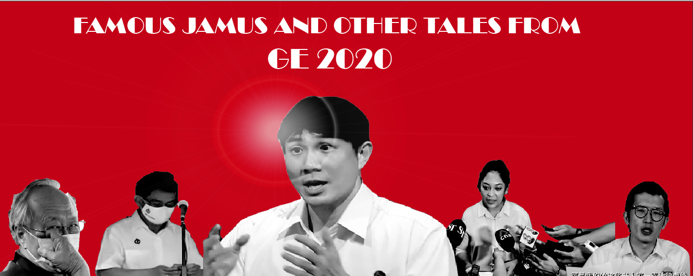{#id .class width=700% height=500%}

Since my previous post, several sites I analysed have been taken down, including Factually Singapore, Fabrications Against the PAP as well as State News Singapore. (Please hold your applause - I deserve no credit given how little people read my previous post.) The removal of these pages is of course, not without its fair share of drama. 

A [petition](https://www.change.org/p/ministry-for-communications-and-information-appeal-to-government-to-investigate-facebook-singapore-team-for-interfering-with-politics?recruiter=1130367112&utm_source=share_petition&utm_medium=facebook&utm_campaign=psf_combo_share_initial&recruited_by_id=643db570-c3c9-11ea-844d-8fad74a85b13&utm_content=fht-23391614-en-gb%3A0) calling for the Ministry of Communications and Information to investigate Facebook for foreign interference in the elections garnered slightly over 500 supporters before being suspended. Petitioners argued that there was political bias in the removal process. Curiously, there was broad consensus that those removed were pro-PAP pages. I can only hope that my analysis is as perceptive as user A Ayu A.


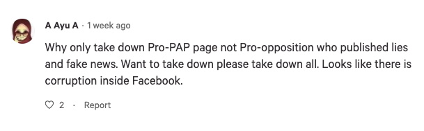{#id .class width=700% height=500%}

Here’s what I found:

1. Although Cooling Off Day was cool, the day before was not. Many pages "chut pattern" (i.e. pulled stunts) hours before Cooling Off Day, presumably to fix a narrative in time for the election. 

2. Serious people and not-so-srs ppl didn’t seem to interact - meme Facebook and political Facebook barely overlapped.

3. Jamus warms the cockles of everyone's hearts (yes, even Ayu's "pro-PAP" pages could not resist him).

4. There was a clear "Sengkang pivot": Sengkang GRC became the new big thing on political Facebook at the expense of East Coast GRC. But this doesn’t appear to be because of Jamus! *gasp*

### Point 1: Before Cooling-Off Day pages began to chut pattern…

**The message from the previous article that not all pages are run the same remains.** The timing of posts continues to differ on two key metrics - (1) activity outside of office hours and (2) extent to which posts are scheduled. Our new entrants, Gong Simi, Shut Down TRS and All Singapore Stuff, fit within the framework that was introduced in the previous article. 

*Gong Simi* appears to operate primarily within office hours with noticeable drops during lunch hours. Within each hour, there are predictable spikes at the start, middle and end of an hour. As previously discussed, the regularity of posts on these pages suggests that these pages may be manned by personnel dedicated to running the page. This is because timing posts is an added activity that page administrators have to factor in in order to structure their pipeline of posts. 

*Shut Down TRS* exhibits behaviour that is rather regular spikes despite having over 4000 Facebook posts. The posts appear to be scheduled at a regular pace every two hours and are almost exclusively posted at the start of each hour. This suggests that the page has a specific purpose given the predictability and volume of the posts. It also suggests that there is very intense and active management of the page by administrators. 

*All Singapore Stuff*, on the other hand, is defined by posts outside office hours and irregular posting times across the hour. The goal of such pages, while still focussed on gaining traction for their posts, have different strategies to do so. These pages exhibit greater evidence of community-run operations. Posters may not be available during office hours, and there may not be a “manager” who deliberately prioritises posts.

*In the two charts below, post frequencies have been normalised (peak activity = 1) to provide a better visual comparison.*

```{r, fig.width=25, fig.height=15}

#time posted - by hour, by maximum frequency, by clustering
### Post time
fbposts$spectime <- as.POSIXct(fbposts$time, 
                               format="%Y-%m-%d %H:%M:%S", 
                               tz="UTC")

fbposts$spectime <-with_tz(fbposts$spectime, "Asia/Hong_Kong")
fbposts$hour<-str_extract(as.character(fbposts$spectime), "[0-9][0-9]:[0-9][0-9]:[0-9][0-9]?")
fbposts$hour<-hour(fbposts$spectime)
fbposts$mins<-minute(fbposts$spectime)

activity_hour_ppap <- fbposts %>%
  group_by(source,hour)%>%
  summarise(post_volume=length(hour))%>%
  na.omit()%>%
  group_by(source) %>% 
  mutate(new = post_volume/max(post_volume))


activity_hour_ppap %>%
  ggplot(aes(x=hour,y=new,group=source)) +
  geom_line(aes(color=source))+
  facet_wrap(~ source) +
  labs(title = "Post activity over one day since page inception (by hour)") +
  labs(x = "Hours", y = "Post\nVolume\n(normalised)") +
  scale_x_continuous(breaks = seq(0, 23, 2), labels = paste(seq(0, 23, 2), "00", sep = ":"))+
  theme_economist()

```


*Frequency of all historical posts within an hour*
```{r, fig.width=25, fig.height=15}
activity_min_ppap <- fbposts %>%
  group_by(source,mins)%>%
  summarise(post_volume=length(mins))%>%
  na.omit()%>%
  group_by(source) %>% 
  mutate(min_norm = post_volume/max(post_volume))

activity_min_ppap %>%
  ggplot(aes(x=mins,y=min_norm,group=source)) +
  geom_line(aes(color=source))+
  facet_wrap(~ source) +
  labs(title = "Post activity over an hour since page inception (by minutes)") +
  labs(x = "Minutes", y = "Post\nVolume\n(normalised)") +
  scale_x_continuous(breaks = seq(0, 59, 10), labels = seq(0, 59, 10))+
  theme_economist()
```


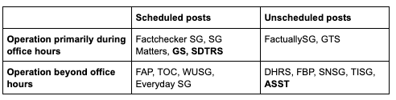{#id .class width=700% height=500%}


```{r, fig.width=25, fig.height=15}
### Post date
date_posted<-fbposts%>%
  select(adDate)%>%
  group_by(adDate)

activity_date_ppap <- fbposts %>%
  dplyr::filter(adYear>2014)%>%
  group_by(source,adDate)%>%
  summarise(post_volume=log(length(adDate)))%>%
  na.omit()

activity_date_ppap %>%
  ggplot(aes(x=adDate,y=post_volume,group=source)) +
  geom_line(aes(color=source))+
  stat_smooth(method = "loess", formula = y ~ x, size = 1)+
  facet_wrap(~ source) +
  labs(title = "Post activity from 2015 onwards") +
  labs(x = "year", y = "Post\nVolume\n(logged)") +
  theme_economist()
```

By and large, post activity trended upwards during the election period before trailing off in the lead up to Cooling Off Day on 9 July. Nonetheless, each page retained its characteristic behaviour in terms of scheduling and office hours, albeit with more posts in the wee hours (**guilty as charged**).

*Two tables comparing within-hour post activity before and during the GE period analysed*

```{r, fig.width=25, fig.height=15}

beforeGE<-activity_hour_ppap %>%
  ggplot(aes(x=hour,y=new,group=source)) +
  geom_line(aes(color=source))+
  facet_wrap(~ source) +
  labs(title = "Post activity over one day since page inception (by hour)") +
  labs(x = "Hours", y = "Post\nVolume\n(normalised)") +
  scale_x_continuous(breaks = seq(0, 23, 2), labels = paste(seq(0, 23, 2), "00", sep = ":"))+
  theme_economist()

## Filter to GE period - Jun 24th to July 10th
ge_filter<-fbposts%>%
  dplyr::filter(adDate >= "2020-06-24", adDate <= "2020-07-10")

activity_date_ge <- ge_filter %>%
  group_by(source,adDate)%>%
  summarise(post_volume=log(length(adDate)))%>%
  na.omit()

activity_hour_ge <- ge_filter %>%
  group_by(source,hour)%>%
  summarise(post_volume=length(hour))%>%
  na.omit()%>%
  group_by(source) %>% 
  mutate(new = post_volume/max(post_volume))

### look at posting activity by hour - are there differences? 
duringGE<-activity_hour_ge %>%
  ggplot(aes(x=hour,y=new,group=source)) +
  geom_line(aes(color=source))+
  facet_wrap(~ source) +
  labs(title = "Post activity over one day since page inception (by hour)") +
  labs(x = "Hours", y = "Post\nVolume\n(normalised)") +
  scale_x_continuous(breaks = seq(0, 23, 2), labels = paste(seq(0, 23, 2), "00", sep = ":"))+
  theme_economist()

grid.arrange(beforeGE, duringGE, ncol=2)
```


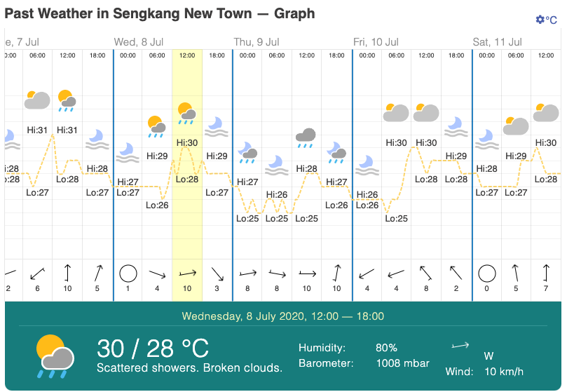{#id .class width=700% height=500%}

However, pages appear to have "chut pattern" just before Cooling Off Day. Many of the pages - especially Shut Down TRS and Gong Simi - recorded a sharp and sudden spike in post activity shortly before rules prohibiting publishing of material which have the ability to influence a voter's decision went into effect. In the case of Gong Simi and Shut Down TRS, post activity almost tripled in the hours leading up to midnight. This spike is likely to be the result of a deliberate effort to increase outreach at the last stretch of the campaign, and set the agenda going into Polling Day. 

```{r, fig.width=25, fig.height=15}
### Day before cooling off (8th)
cod_filter<-fbposts%>%
  dplyr::filter(adDate >= "2020-07-08", adDate <= "2020-07-08")

activity_hour_cod <- cod_filter %>%
  group_by(source,hour)%>%
  summarise(post_volume=length(hour))%>%
  na.omit()%>%
  group_by(source) %>% 
  mutate(new = post_volume/max(post_volume))

### look at posting activity by hour - are there differences? 
activity_hour_cod %>%
  ggplot(aes(x=hour,y=new,group=source)) +
  geom_line(aes(color=source))+
  facet_wrap(~ source) +
  labs(title = "Post activity over one day on day before Cooling Day (by hour)") +
  labs(x = "Hours", y = "Post\nVolume\n(normalised)") +
  scale_x_continuous(breaks = seq(0, 23, 2), labels = paste(seq(0, 23, 2), "00", sep = ":"))+
  theme_economist()
```


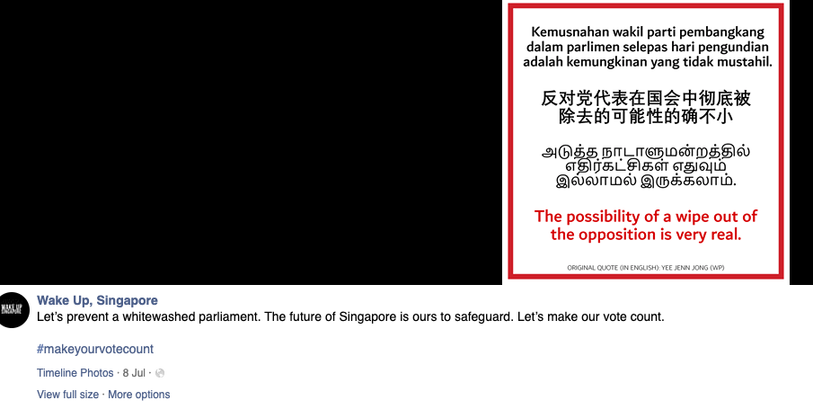{#id .class width=700% height=500%}


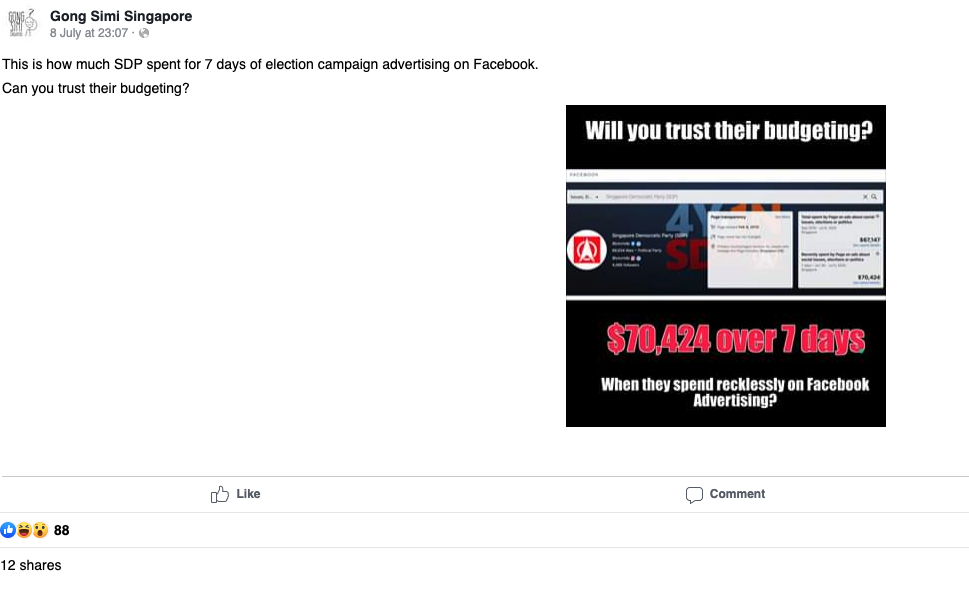{#id .class width=700% height=500%}


### Point 2: Meme Facebook and Political Facebook barely overlapped unless a saga occurred (not so serious people and serious people don't seem to interact that much)

The 2020 General Election rose up to the Tall Order (read: book reference) of delivering quality meme content in a shorter 9-day campaign period. So to that…*thumbs up, man!*


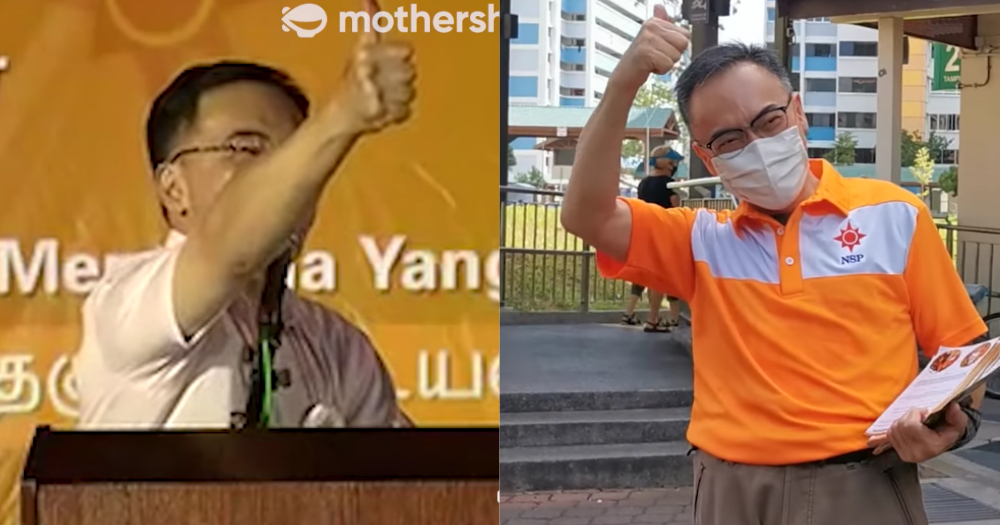{#id .class width=700% height=800%}


We revisit four golden moments (the East Coast Plan, the Charles Yeo hard carry, Jamus's cockles as well as Marymount SMC's impeding stand-by-universe) and 2 incidents (#IStandWithRaeesah and Ivan Lim) to understand how memes and political Facebook interacted. 


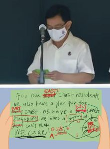{#id .class width=400% height=900%}


{#id .class width=700% height=500%}


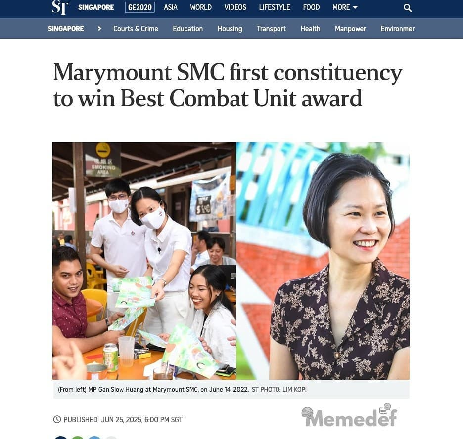{#id .class width=700% height=600%}


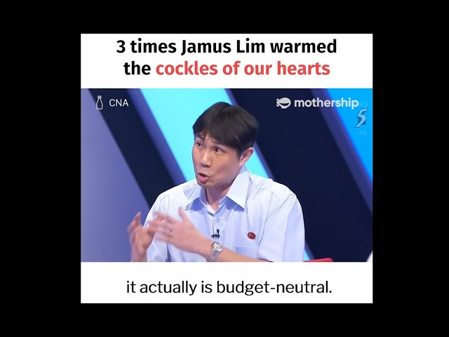{#id .class width=700% height=500%}


```{r, fig.width=25, fig.height=15}
### Jamus Lim
find<-c("\\bjamus\\b") #find words
jamus_list = list()

jamus_posts<-ge_filter%>%
  dplyr::filter(grepl(paste(find,collapse="|"), tolower(text)))

sites<-unique(jamus_posts$source)

### Mentions over time during election period
activity_date_jamus <- jamus_posts %>%
  group_by(adDate) %>% 
  count()%>%
  dplyr::rename(jamus= n)

### The East Coast Plan
### East Coast Plan
find<-c("\\beast coast plan\\b","\\bwe care\\b","\\bat east coast\\b", "\\bwe have a together\\b") #find words
ECP_list = list()

ECP_posts<-ge_filter%>%
  dplyr::filter(grepl(paste(find,collapse="|"), tolower(text)))

sites<-unique(ECP_posts$source)

### Mentions over time during election period
activity_date_ECP <- ECP_posts %>%
  group_by(adDate) %>% 
  count()%>%
  dplyr::rename(eastcoastplan= n)

### Charles Yeo

find<-c("\\bcharles\\b","\\bcharles yeo\\b") #find words
charles_list = list()

charles_posts<-ge_filter%>%
  dplyr::filter(grepl(paste(find,collapse="|"), tolower(text)))

sites<-unique(charles_posts$source)

### Mentions over time during election period
activity_date_charles <- charles_posts %>%
  group_by(adDate) %>% 
  count()%>%
  dplyr::rename(charles= n)

### Marymount SMC

find<-c("\\bmarymount\\b","\\bmarymount yeo\\b") #find words
marymount_list = list()

marymount_posts<-ge_filter%>%
  dplyr::filter(grepl(paste(find,collapse="|"), tolower(text)))

sites<-unique(marymount_posts$source)

### Mentions over time during election period
activity_date_marymount <- marymount_posts %>%
  group_by(adDate) %>% 
  count()%>%
  dplyr::rename(marymount= n)

## Combine memes
compare_memes<-merge(activity_date_ECP,activity_date_charles,by="adDate",all=TRUE)
compare_memes[is.na(compare_memes)] <- 0
compare_memes<-merge(compare_memes,activity_date_marymount,by="adDate",all=TRUE)
compare_memes[is.na(compare_memes)] <- 0
compare_memes<-merge(compare_memes,activity_date_jamus,by="adDate",all=TRUE)
compare_memes[is.na(compare_memes)] <- 0

compare_memes<- melt(compare_memes, id.vars='adDate')

compare_memes_compare <- compare_memes%>%
  dplyr::rename(memes= variable)


ggplot(compare_memes_compare , aes(x=adDate,y=value))+
  geom_line(aes(color=memes))+
  ggtitle("Discussion about 4 key memes over GE period")+
  scale_x_date(date_breaks = 'day', 
               date_labels = '%b %d\n%a')+
  labs(x = "Date", y = "Number of posts")+
  theme_economist() 
```

What is clear from the graphs that capture the mention rates of specific events or persons over the GE period is that there is greater synchrony between the meme cycle and posts on political Facebook if it involves an unfolding saga. Otherwise, Meme Facebook and Political Facebook do not really overlap as they clearly have two distinct agendas. The former utilises everyday subject matter - which can happen to be politics - to reach an end goal of generating 'LOLs' while the latter invokes discussion of political subject matter to support a particular political narrative. Memeable content does not really gain traction on political Facebook as it is generally speaking, an abstraction of an instance rather than a solid foundation for policy critique. No posts - save the East Coast Plan - was referred to by political Facebook during the course of the General Election period.  As such, the various Charles Yeo (spawned as a result of his constituency political broadcast) and East Coast Plan memes failed to gain traction on political Facebook. Mentions of both remained relatively constant (and low) throughout the GE period. 

What both meme and political Facebook latch onto are unfolding political sagas. Meme Facebook can utilise the many instances associated with a personality to generate more content while sagas can be used by political Facebook to draw attention to broader political issues such as elitism, racism and religion. 


{#id .class width=700% height=700%}


```{r, fig.width=25, fig.height=15}
### Ivan Lim
find<-c("\\bivan\\b") #find words
ivan_list = list()

ivan_posts<-ge_filter%>%
  dplyr::filter(grepl(paste(find,collapse="|"), tolower(text)))

sites<-unique(ivan_posts$source)

### Mentions over time during election period
activity_date_ivan <- ivan_posts %>%
  group_by(adDate) %>% 
  count()

ggplot(activity_date_ivan, aes(x=adDate,y=n))+
  geom_line()+
  geom_point()+
  ggtitle("Discussion about Ivan Lim over GE period")+
  theme_economist() +
  labs(x = "Date", y = "Number of posts") 
```


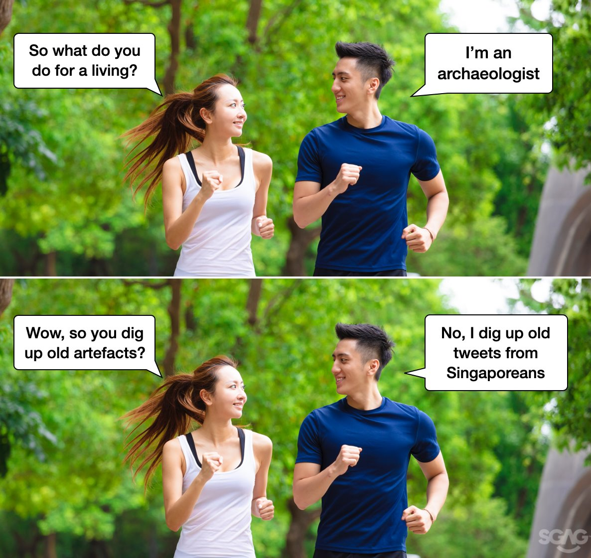{#id .class width=700% height=700%}

```{r, fig.width=25, fig.height=15}
### Raeesah Khan
find<-c("raeesah","khan") #find words
raeesah_list = list()

raeesah_posts<-ge_filter%>%
  dplyr::filter(grepl(paste(find,collapse="|"), tolower(text)))

sites<-unique(raeesah_posts$source)

### Mentions over time during election period
activity_date_raeesah <- raeesah_posts %>%
  group_by(adDate) %>% 
  count()

ggplot(activity_date_raeesah, aes(x=adDate,y=n))+
  geom_line()+
  geom_point()+
  ggtitle("Discussion about Raeesah Khan over GE period")+
  theme_economist() +
  labs(x = "Date", y = "Number of posts") 

```

### Point 3: Jamus warms the cockles of everyone's hearts (yes, even Ayu's "pro-PAP" pages could not resist him).

```{r, fig.width=25, fig.height=15}

### Jamus Lim
find<-c("\\bjamus\\b") #find words
jamus_list = list()

jamus_posts<-ge_filter%>%
  dplyr::filter(grepl(paste(find,collapse="|"), tolower(text)))

sites<-unique(jamus_posts$source)

### Mentions over time during election period
activity_date_jamus <- jamus_posts %>%
  group_by(adDate) %>% 
  count()

ggplot(activity_date_jamus, aes(x=adDate,y=n))+
  geom_line()+
  geom_point()+
  ggtitle("Discussion about Jamus over GE period")+
  theme_economist() +
  labs(x = "Date", y = "Number of posts") 
```

Interest in Jamus peaked on July 1 and 2 after the broadcast of the party debates on national television where his performance received rave reviews from political pundits, [debate coaches](https://mothership.sg/2020/07/debate-coach-rank-political-debate/) and [random social media commentators](https://www.asiaone.com/digital/wps-jamus-lim-and-paps-vivian-balakrishnan-wins-over-internet-after-their-ge2020-debate) alike. He received overwhelmingly positive coverage across all six sites in which his name was mentioned. 

```{r, fig.width=25, fig.height=15}
### Sentiment
find<-c("\\bjamus\\b") #find words
jamus_list = list()

jamus_posts<-ge_filter%>%
  dplyr::filter(grepl(paste(find,collapse="|"), tolower(text)))

sites<-unique(jamus_posts$source)

for (i in sites){
  filtered_frame<-dplyr::filter(jamus_posts,jamus_posts$source==i)
  emo_baro <- get_nrc_sentiment(filtered_frame$text)
  emocol<-colSums(emo_baro)
  jamus_list[[i]] <- emocol
}
jamus_data = do.call(cbind, jamus_list)
emo_sum_jamus<-scale(jamus_data[-c(2,8,9,10),])
emo_sum_jamus<-scale(jamus_data[,-c(2)])
pheatmap(emo_sum_jamus, treeheight_row = 0, treeheight_col = 0, main="Heatmap of sentiments when discussing Jamus Lim")
```

In the previous article, I [mentioned that there was a clear political divide when it came to the discussion of domestic issues by political Facebook pages](https://kyiyeunggoh.github.io/Other%20Projects/Facebook%20Opinion%20Pages/Political-FB-Article.html). There is evidence that pages are removed regardless of their affiliations. The three pages that are removed - 2 can be defined as having more positive coverage of the ruling party while the other is clearly more critical. What is startling then is that Jamus manages to breach this divide to attain some form of positive sentiment from both "pro-PAP" and "anti-PAP" pages. 

### Point 4: There was a clear "Sengkang pivot": Sengkang GRC became the new big thing on political Facebook at the expense of East Coast GRC. But this doesn’t appear to be because of Jamus! *gasp*

```{r, fig.width=25, fig.height=15}
### Sengkang GRC
find<-c("sengkang") #find words
sengkang_list = list()

sengkang_posts<-ge_filter%>%
  dplyr::filter(grepl(paste(find,collapse="|"), tolower(text)))

sites<-unique(sengkang_posts$source)

### Mentions over time during election period
activity_date_sengkang <- sengkang_posts %>%
  group_by(adDate) %>% 
  count()%>%
  dplyr::rename(Sengkang= n)

### East Coast GRC
find<-c("east coast") #find words
eastcoast_list = list()

eastcoast_posts<-ge_filter%>%
  dplyr::filter(grepl(paste(find,collapse="|"), tolower(text)))

sites<-unique(eastcoast_posts$source)

### Mentions over time during election period
activity_date_eastcoast <- eastcoast_posts %>%
  group_by(adDate) %>% 
  count()%>%
  dplyr::rename(EastCoast= n)

## Combine sengkang and East Coast
compare_grc<-merge(activity_date_sengkang,activity_date_eastcoast,by="adDate")
compare_grc<-pad(compare_grc)
compare_grc[is.na(compare_grc)] <- 0
  
compare_grc <- melt(compare_grc, id.vars='adDate')

compare_grc <- compare_grc%>%
  dplyr::rename(GRC= variable)

ggplot(compare_grc, aes(x=adDate,y=value))+
  geom_line(aes(color=GRC))+
  geom_vline(xintercept = as.numeric(ymd("2020-06-30")), linetype="dashed", 
             color = "black", size=1.5)+
  geom_vline(xintercept = as.numeric(ymd("2020-07-01")), linetype="dashed", 
             color = "black", size=1.5)+
  geom_vline(xintercept = as.numeric(ymd("2020-07-05")), linetype="dashed", 
             color = "black", size=1.5)+
  ggtitle("Discussion about Sengkang and East Coast GRC over GE period")+
  scale_x_date(date_breaks = 'day', 
               date_labels = '%b %d\n%a')+
  labs(x = "Date", y = "Number of posts")+
  theme_economist() 
```

Prior to nomination day, East Coast GRC was [branded by political pundits as the GRC to watch](https://www.straitstimes.com/politics/no-easy-fight-for-east-coast) given the relatively close contests between the People's Action Party (PAP) and Workers' Party (WP) in 2011 and 2015. However, Deputy Prime Minister Heng Swee Keat's surprise candidacy resulted in a shift in the media narrative. [One of the WP candidates for East Coast, Nicole Seah, argued that it was unfair for voters to decide between Opposition representation and a PM-in-waiting](https://www.todayonline.com/singapore/ge2020-unfair-east-coast-grc-voters-face-dilemma-electing-pm-waiting-or-opposition-says-wp).  5 of the 7 posts about East Coast GRC on 1 July directly addressed this surprise candidacy. 

["[F]ormer PAP MP Inderjit Singh: "When Mr Heng moved to East Coast, people felt there was little chance of the WP winning that GRC, so the attention shifted to the WP's next-strongest team.""](http://webcache.googleusercontent.com/search?q=cache%3Awww.straitstimes.com%2Fpolitics%2Fsengkang-new-grc-springs-some-surprises&oq=cache%3Awww.straitstimes.com%2Fpolitics%2Fsengkang-new-grc-springs-some-surprises&aqs=chrome..69i57j69i58.886j0j4&sourceid=chrome&ie=UTF-8)

Commentators then began to speak of a "close contest" in Sengkang GRC especially after WP candidate Jamus Lim's performance on the televised debates on 1 July. Subsequently on 4 July, Prime Minister Lee Hsien Loong appeared on a PAP webinar with the Sengkang GRC team. Deputy Prime Minister Teo Chee Hean joined a walkabout in Rivervale Plaza on the following day. However, this shifting mainstream media attention to Sengkang GRC did not appear to have affected post activity on political Facebook.

Attention on Sengkang GRC on these pages only rocketed after news of a police report lodged against WP candidate, Raeesah Khan. Around 40% of all posts discussing Sengkang GRC on or after 5 July directly address the police reports. If we look at the mentions of Jamus on political Facebook, it was the renewed interest in Sengkang GRC that led to his secondary mentions peak. 

Interestingly, Singapore Matters seemed to be prescient when it posted the following on 4 July at around 11am Singapore Time, on the same day as the [1 of 2 police reports](https://mothership.sg/2020/07/workers-party-raeesah-khan-sengkang-grc/) that were lodged. Unfortunately, the data cannot prove whether there was coordination involved, or whether the reports were inspired by Singapore Matters’ sleuthing. 

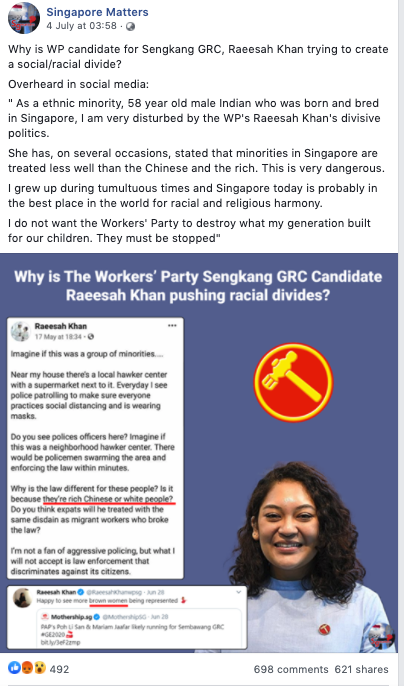{#id .class width=700% height=700%}


### Endnote
Ultimately, what we are witnessing is an increasingly dynamic and complex social media ecosystem where political matters about Singapore is concerned. However, as much as they had some agency in affecting public opinion (i.e. period before Cooling Off Day), they nonetheless exist as part of a broader system of communications. These pages do get affected by events beyond their control. As a consumer of online information, I'd be concerned about how these pages are run and their role in shaping our political discourse in the years to come. 


