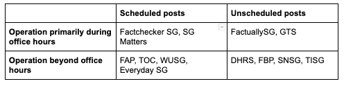

```{r setup, include=FALSE}
knitr::opts_chunk$set(echo=FALSE)
library(readr)
library(readxl)
library(zoo)
library(stringi)
library(dplyr)
library(readxl)
library(DT)
library(stringr)
library(pdftools)
library(qdapRegex)
library(maps)
library(SnowballC)
library(tm)
library(openxlsx)
library(tidytext)
library(qdapRegex)
library(lubridate)
library(SnowballC)
library(tm)
library(twitteR)
library(syuzhet)
library(plotly)
library(tidyverse)
library(gutenbergr)
library(tidytext)
library(stringr)
library(topicmodels)
library(tidyverse)
library(corrplot)
library(reshape2)
library(forecast)
library(sandwich)
library(ggplot2)
library(zoo)
library(lmtest)
library(car)
library(fUnitRoots)
library(stargazer)
library(kableExtra)
library(wordcloud)
library(purrrlyr)
library(syuzhet)
library(viridis)
library(pheatmap)
library(ggthemes)

fbposts<-read_xlsx("combined_fb_posts.xlsx")
fbposts$adDate<-str_extract(as.character(fbposts$time), "[0-9][0-9][0-9][0-9]-[0-9][0-9]-[0-9][0-9]")
fbposts$adDate<-as.Date(fbposts$adDate)
fbposts$adYear<-year(fbposts$adDate)
table1<-read_xlsx("Table_Page Intro.xlsx")
table1$`Found date`<-as.Date(table1$`Found date`, format="%Y-%m-%d")
table2<-read_xlsx("table 2_Matrix.xlsx")
table3<-read_xlsx("table3_cluster1.xlsx")
table4<-read_xlsx("table4_cluster2.xlsx")
tablebigsites<-read_xlsx("table_comparebig.xlsx")
tablebigsmallsites<-read_xlsx("table_comparebigsmall.xlsx")
```

{#id .class width=700% height=500%}

## Introduction

In 2019, 62% of Singaporeans surveyed by the Reuters Institute consumed news via social media. [Almost half (48%) specified that they did so on Facebook](http://www.digitalnewsreport.org/survey/2019/singapore-2019/). Aside from the traditional players, such as the mainstream media, Facebook has enabled even small set-ups to propagate news and views with ease. Who runs these pages? How do they behave, and how are they different from the mainstream media? What impact do they have on our public discourse?

Some of these questions can be answered with reference to the facts. This article collates, cleans, and analyses around 34,000 Facebook posts posted from 12 such pages before 11 June 2020 that provide active commentary of current affairs to better understand:

(i) how such pages tend to be operated
(ii) the nature of the discourse by such pages across different policy settings
(iii) the interaction (if any) between these pages 

The 12 pages were selected as they can be considered non-mainstream outlets who reach their audiences primarily through social media. Some of these sites - The Independent Singapore and The Online Citizen - do have standalone sites but nonetheless interact with many of the sites studied on Facebook. These 12 pages are non-exhaustive and findings will be updated in line with studies of other pages. 
 

*Note: Fabrications About the PAP [has since been taken down by Facebook on June 28](https://www.channelnewsasia.com/news/singapore/facebook-removes-fabrications-about-the-pap-accounts-12878360). Facebook cited page behaviour in determining that the site had violated its community standards.*

The main findings are:

1. **Not all pages run the same.** The timing of posts on these pages differ on two key metrics - (1) activity outside of office hours and (2) extent to which posts are scheduled 

2. **Beyond good and evil?** The pages can broadly be divided into two distinct camps that are either exclusively pro or anti-Government divide when discussing domestic politics. Yet this categorisation does not hold up as well when analysing discussion of foreign affairs. 

3. **Echo chambers or sparring grounds?** These 12 pages are aware of each other's presence - especially those with larger follower bases. Some sites function exclusively as content generators while others serve to broadcast content that align with the page's political sympathies. 


### An overview of the pages studied
The 12 pages differ on several metrics - number of likes, the date which they first became active, the number of posts to date as well as the location of their administrators. A summary of this can be found in the table below: 

```{r}
datatable(table1,class = 'cell-border stripe')
```

## 1. NOT ALL PAGES ARE RUN THE SAME  

We can analyse the timing of each page’s posts over a day and within each hour. This reveals four distinct modes of operations. 


```{r, fig.width=25, fig.height=15}
fbposts$spectime <- as.POSIXct(fbposts$time, 
                               format="%Y-%m-%d %H:%M:%S", 
                               tz="UTC")

fbposts$spectime <-with_tz(fbposts$spectime, "Asia/Hong_Kong")
fbposts$hour<-str_extract(as.character(fbposts$spectime), "[0-9][0-9]:[0-9][0-9]:[0-9][0-9]?")
fbposts$hour<-hour(fbposts$spectime)
fbposts$mins<-minute(fbposts$spectime)

activity_hour_ppap <- fbposts %>%
  group_by(source,hour)%>%
  summarise(post_volume=length(hour))%>%
  na.omit()%>%
  group_by(source) %>% 
  mutate(new = post_volume/max(post_volume))

activity_hour_ppap %>%
  ggplot(aes(x=hour,y=new,group=source)) +
  geom_line(aes(color=source))+
  facet_wrap(~ source) +
  labs(title = "Post activity over one day since page inception (by hour)") +
  labs(x = "Hours", y = "Post\nVolume\n(normalised)") +
  scale_x_continuous(breaks = seq(0, 23, 2), labels = paste(seq(0, 23, 2), "00", sep = ":"))+
  theme_economist()
```

*In the chart above, post frequencies have been normalised (peak activity = 1) to provide a better visual comparison.*

```{r, fig.width=25, fig.height=15}
activity_hour_ppap %>%
  ggplot(aes(x=hour,y=post_volume,group=source)) +
  geom_line(aes(color=source))+
  facet_wrap(~ source) +
  labs(title = "Post activity over one day since page inception (by hour)") +
  labs(x = "Hours", y = "Post\nVolume\n(raw)") +
  scale_x_continuous(breaks = seq(0, 23, 2), labels = paste(seq(0, 23, 2), "00", sep = ":"))+
  theme_economist()
```

```{r, fig.width=25, fig.height=15}
activity_min_ppap <- fbposts %>%
  group_by(source,mins)%>%
  summarise(post_volume=length(mins))%>%
  na.omit()%>%
  group_by(source) %>% 
  mutate(min_norm = post_volume/max(post_volume))

activity_min_ppap %>%
  ggplot(aes(x=mins,y=min_norm,group=source)) +
  geom_line(aes(color=source))+
  facet_wrap(~ source) +
  labs(title = "Post activity over an hour since page inception (by minutes)") +
  labs(x = "Minutes", y = "Post\nVolume\n(normalised)") +
  scale_x_continuous(breaks = seq(0, 59, 10), labels = seq(0, 59, 10))+
  theme_economist()
```

*In the chart above, post frequencies have been normalised (peak activity = 1) to provide a better visual comparison.*

The **first group** which includes pages such as factcheckersg and SG Matters appear to operate exclusively during working hours while also scheduling posts throughout the day. 

Posts tend to begin at 8am and stop by 8pm. On certain pages such as factcheckersg, no posts are observed before 7am and after 10pm. From a social media optimisation point of view, this may seem odd, as activity is usually higher during commuting, lunch, and after dinner hours to drive reach and reactions. It could suggest that this category of pages does not aim to maximise reach.

```{r,fig.width=20, fig.height=10}
activity_hour_ppap %>%
  dplyr::filter(source=='factcheckersg'|source=='sgmatters')%>%
  ggplot(aes(x=hour,y=new,group=source)) +
  geom_line(aes(color=source))+
  facet_wrap(~ source) +
  labs(title = "Post activity over one day since page inception (by hour)") +
  labs(x = "Hours", y = "Post\nVolume\n(normalised)") +
  scale_x_continuous(breaks = seq(0, 23, 2), labels = paste(seq(0, 23, 2), "00", sep = ":"))+
  theme_economist()
```

A sharp dip in post frequency during lunch hour - between 11am and 1pm - is also observed across sites in this category. 

{#id .class width=500% height=300%}

At the same time, these pages post at specific minutes in each hour. The regularity of posts on these pages suggests that these pages may be  manned by personnel dedicated to running the page. This is because the timing posts is an added activity that page administrators have to factor in in order to structure their pipeline of posts. In the case of SG Matters, the persistent presence of posts beyond the start, mid and end-point of the hour may indicate the presence of spare capacity that monitors and responds to ad-hoc policy issues that emerge.  

```{r,fig.width=20, fig.height=10}
activity_min_ppap %>%
  dplyr::filter(source=='factcheckersg'|source=='sgmatters')%>%
  ggplot(aes(x=mins,y=min_norm,group=source)) +
  geom_line(aes(color=source))+
  facet_wrap(~ source) +
  labs(title = "Post activity over an hour since page inception (by minutes)") +
  labs(x = "Minutes", y = "Post\nVolume\n(normalised)") +
  scale_x_continuous(breaks = seq(0, 59, 10), labels = seq(0, 59, 10))+
  theme_economist()
```


This similarity in operations is striking especially given the large difference in their post volumes and following. 

```{r,fig.width=20, fig.height=10}
activity_hour_ppap %>%
  dplyr::filter(source=='factcheckersg'|source=='sgmatters')%>%
  ggplot(aes(x=hour,y=post_volume,group=source)) +
  geom_line(aes(color=source))+
  facet_wrap(~ source) +
  labs(title = "Post activity over one day since page inception (by hour)") +
  labs(x = "Hours", y = "Post\nVolume\n(raw)") +
  scale_x_continuous(breaks = seq(0, 23, 2), labels = paste(seq(0, 23, 2), "00", sep = ":"))+
  theme_economist()
```

The **second cluster** of pages consisting of factuallysg and Global Times Singapore tend to operate primarily during office hours but appear to have no discernable pattern in terms of post over the hour. 

```{r,fig.width=20, fig.height=10}
activity_hour_ppap %>%
  dplyr::filter(source=='factuallysg'|source=='GTS')%>%
  ggplot(aes(x=hour,y=new,group=source)) +
  geom_line(aes(color=source))+
  facet_wrap(~ source) +
  labs(title = "Post activity over one day since page inception (by hour)") +
  labs(x = "Hours", y = "Post\nVolume\n(normalised)") +
  scale_x_continuous(breaks = seq(0, 23, 2), labels = paste(seq(0, 23, 2), "00", sep = ":"))+
  theme_economist()
```

Like the first cluster of sites, these pages share the same features of low post volume during lunch and out-of-office hours. However, where they differ most distinctly is the post volume over the course of the hour. 

```{r,fig.width=20, fig.height=10}
activity_min_ppap %>%
  dplyr::filter(source=='factuallysg'|source=='GTS')%>%
  ggplot(aes(x=mins,y=min_norm,group=source)) +
  geom_line(aes(color=source))+
  facet_wrap(~ source) +
  labs(title = "Post activity over an hour since page inception (by minutes)") +
  labs(x = "Minutes", y = "Post\nVolume\n(normalised)") +
  scale_x_continuous(breaks = seq(0, 59, 10), labels = seq(0, 59, 10))+
  theme_economist()
```

The lack of a discernible post pattern suggests that the pages, while also possibly professionally managed, serve a different function from the pages identified in the first cluster. The randomness of post times over the hour could indicate their more 'responsive', just-in-time function of reacting to emerging political issues, or a lack of a pipeline of ready-made posts. 

The **third cluster** consists of pages that operate beyond office hours and actively schedule posts. 

```{r,fig.width=20, fig.height=10}
activity_hour_ppap %>%
  dplyr::filter(source=='FAP'|source=='TOC'|source=='WUSG'|source=='everydaysg')%>%
  ggplot(aes(x=hour,y=new,group=source)) +
  geom_line(aes(color=source))+
  facet_wrap(~ source) +
  labs(title = "Post activity over one day since page inception (by hour)") +
  labs(x = "Hours", y = "Post\nVolume\n(normalised)") +
  scale_x_continuous(breaks = seq(0, 23, 2), labels = paste(seq(0, 23, 2), "00", sep = ":"))+
  theme_economist()
```


These four pages - Everyday SG, fabrications about the PAP, The Online Citizen and Wake Up Singapore - continue to post sporadically at odd hours especially during times when social media is most active. It is interesting that all four pages command a significantly larger following than the pages that were in clusters 1 and 2. These pages also appear to have deliberate posting strategies and professionalisation, as evidenced by the presence of distinct posting times over the hour. This most closely mimics an optimised social media operation one might expect of a large business or organisation. Taken together, it suggests that the focus of these pages is to focus on catching eyeballs with the intent of influencing opinions to perspectives shared on the pages.  

```{r,fig.width=20, fig.height=10}
activity_min_ppap %>%
  dplyr::filter(source=='FAP'|source=='TOC'|source=='WUSG'|source=='everydaysg')%>%
  ggplot(aes(x=mins,y=min_norm,group=source)) +
  geom_line(aes(color=source))+
  facet_wrap(~ source) +
  labs(title = "Post activity over an hour since page inception (by minutes)") +
  labs(x = "Minutes", y = "Post\nVolume\n(normalised)") +
  scale_x_continuous(breaks = seq(0, 59, 10), labels = seq(0, 59, 10))+
  theme_economist()
```

The **last cluster** of pages - Democracy and Human Rights in Singapore, Fabrications By the PAP, State News Singapore and The Independent Singapore - are defined by posts outside office hours and irregular posting times across the hour. The goal of such pages, while still focussed on gaining traction for their posts, have different strategies to do so. These pages, with the possible exception of The Independent Singapore given its scale, exhibits greater evidence of community-run operations. Posters may not be available during office hours, and may not be deliberately prioritising posts.

It is interesting to note that the posting activity of Fabrications By the PAP witnesses a sudden, unique uptick in activity nearing midnight.  

```{r,fig.width=20, fig.height=10}
activity_hour_ppap %>%
  dplyr::filter(source=='DHRS'|source=='FBP'|source=='SNSG'|source=='TISG')%>%
  ggplot(aes(x=hour,y=new,group=source)) +
  geom_line(aes(color=source))+
  facet_wrap(~ source) +
  labs(title = "Post activity over one day since page inception (by hour)") +
  labs(x = "Hours", y = "Post\nVolume\n(normalised)") +
  scale_x_continuous(breaks = seq(0, 23, 2), labels = paste(seq(0, 23, 2), "00", sep = ":"))+
  theme_economist()
```

```{r,fig.width=20, fig.height=10}
activity_min_ppap %>%
  dplyr::filter(source=='FAP'|source=='TOC'|source=='WUSG'|source=='everydaysg')%>%
  ggplot(aes(x=mins,y=min_norm,group=source)) +
  geom_line(aes(color=source))+
  facet_wrap(~ source) +
  labs(title = "Post activity over an hour since page inception (by minutes)") +
  labs(x = "Minutes", y = "Post\nVolume\n(normalised)") +
  scale_x_continuous(breaks = seq(0, 59, 10), labels = seq(0, 59, 10))+
  theme_economist()
```

What is clear, however, is the growing importance of social media in structuring, responding to and influencing debates on current affairs. Page activity has increased exponentially across almost all of the 12 pages analysed, perhaps due to the impending general election. However, the increase in post activity has been sharpest in pages that are most politically engaged - they are namely Democracy and Human Rights in Singapore, SG Matters, Wake Up Singapore, Fabrications Against the PAP, The Online Citizen and The Independent SG.

```{r, fig.width=25, fig.height=10}
date_posted<-fbposts%>%
  select(adDate)%>%
  group_by(adDate)

activity_date_ppap <- fbposts %>%
  dplyr::filter(adYear>2014)%>%
  group_by(source,adDate)%>%
  summarise(post_volume=log(length(adDate)))%>%
  na.omit()

activity_date_ppap %>%
  ggplot(aes(x=adDate,y=post_volume,group=source)) +
  geom_line(aes(color=source))+
  stat_smooth(method = "loess", formula = y ~ x, size = 1)+
  facet_wrap(~ source) +
  labs(title = "Post activity from 2015 onwards") +
  labs(x = "year", y = "Post\nVolume\n(logged)") +
  theme_economist()
```

## 2. BEYOND GOOD AND EVIL?

This analysis suggests that there is some truth that pages can be broken down into "pro" or "anti" government categories. However, such a categorisation may also be overly reductive. To analyse this, periods where more than 5 of the 12 pages are engaged in discussion about the same issue for more than 7 days were selected. The events selected are as follows: 

I. Domestic issues: 2016 Bukit Batok By-election  
II. Foreign affair issues: Terrex Incident 

### I. 2016 Bukit Batok By-election

```{r, fig.width=25, fig.height=10}
activity_rate<-na.omit(activity_date_ppap)
top_activity_pp<-activity_rate%>%
  group_by(source) %>%
  top_n(n = 1)

## See the overlap of periods for all sites - for each sites top posts (more than 5 sites, sustained over 4 consecutive days that is non-Covid related)
top_activity_period<-activity_rate%>%
  group_by(source) %>%
  top_n(n = 100)

## 12 March 2016 to 8 May 2016 (Bukit Batok By-election, resignation of David Ong until day after election results)
## Murali Pillai, David Ong, Chee Soon Juan
batok_posts<-fbposts%>%
  dplyr::filter(adDate >= "2016-03-12", adDate <= "2016-05-08")

## activity during that period
bukitbatok_rate <- batok_posts%>%
  group_by(source,adDate)%>%
  summarise(post_volume=length(adDate))%>%
  na.omit()

ggplot(bukitbatok_rate, aes(x=adDate,y=post_volume,group=source))+
  geom_line(aes(color=source))+
  ggtitle("Page post activity during period of 2016 Bukit Batok SMC by-election") +
  theme_economist() +
  theme(plot.title = element_text(hjust = 0.5))+
  labs(x = "Date", y = "Number of posts") 
```

The 2016 Bukit Batok By-election witnessed a period of sustained activity between 7 of the 12 pages. The period of interaction began in earnest with the resignation of then-Member of Parliament David Ong from the People's Action Party (PAP) on March 12 and ended with the release of the by-election results on May 7. Other significant personalities involved in the election are Murali Pillai, the PAP's candidate in the by-election and Chee Soon Juan, candidate for the Singapore Democratic Party (SDP). 

```{r}
find<-c("\\bcsj\\b","\\bchee soon juan\\b") #find words
csj_list = list()
filter_frame<-dplyr::filter(batok_posts, grepl(paste(find,collapse="|"), tolower(batok_posts$text)))
sites<-unique(filter_frame$source)

for (i in sites){
  filtered_frame<-dplyr::filter(filter_frame,filter_frame$source==i)
  emo_baro <- get_nrc_sentiment(filtered_frame$text)
  emocol<-colSums(emo_baro)
  csj_list[[i]] <- emocol
}
csj_data = do.call(cbind, csj_list)
emo_sum_csj<-scale(csj_data[-c(2,8,9,10),1:6])
pheatmap(emo_sum_csj, treeheight_row = 0, treeheight_col = 0, main="Heatmap of sentiments when discussing Chee Soon Juan")

```

```{r}
### Sentiment of posts - DAVID ONG
find<-c("\\bdavid\\b","\\bwendy\\b") #find words
david_list = list()
filter_frame<-dplyr::filter(batok_posts, grepl(paste(find,collapse="|"), tolower(batok_posts$text)))
sites<-unique(filter_frame$source)

for (i in sites){
  filtered_frame<-dplyr::filter(filter_frame,filter_frame$source==i)
  emo_baro <- get_nrc_sentiment(filtered_frame$text)
  emocol<-colSums(emo_baro)
  david_list[[i]] <- emocol
}
david_data = do.call(cbind, david_list)
emo_sum_david<-scale(david_data[-c(2,8,9,10),1:5])
pheatmap(emo_sum_david, treeheight_row = 0, treeheight_col = 0, main="Heatmap of sentiments when discussing David Ong")

```

```{r}
find<-c("\\bmurali \\b","\\bah mu\\b","\\bpillai \\b") #find words
murali_list = list()
filter_frame<-dplyr::filter(batok_posts, grepl(paste(find,collapse="|"), tolower(batok_posts$text)))
sites<-unique(filter_frame$source)

for (i in sites){
  filtered_frame<-dplyr::filter(filter_frame,filter_frame$source==i)
  emo_baro <- get_nrc_sentiment(filtered_frame$text)
  emocol<-colSums(emo_baro)
  murali_list[[i]] <- emocol
}
murali_data = do.call(cbind, murali_list)
emo_sum_murali<-scale(murali_data[-c(2,8,9,10),1:7])
pheatmap(emo_sum_murali, treeheight_row = 0, treeheight_col = 0, main="Heatmap of sentiments when discussing Murali Pillai")
```

A sentiment analysis of these three personalities will be useful in understanding the political dispositions of Facebook pages. The text was pre-processed and then analysed for the sentiments using the NRC dictionary in R. One key limitation is that the dictionary will not be able to capture emotional language that is not in the English language. Nonetheless, a manual run through of the posts (*by a native Singlish speaker*) indicates that this was still a useful barometer of overall emotional sentiment towards the candidate on a page. 

Across all pages, there was a consistent appeal to raw emotions when reaching out to their audiences. In many instances, the use of emotions clearly mapped onto a clear “either for or against” dynamic. For instance, fear was detected as the predominant emotion when The Independent Singapore was discussing the PAP’s candidate while anger featured prominently as an emotion when analysing Fabrications against the PAP’s coverage of the Opposition candidate, Chee Soon Juan. 

**Shades of grey when discussing foreign affairs**

However, the simple “black and white” dynamic is challenged when analysing posts by the 12 pages when dealing with matters of foreign affairs. On November 23rd 2016, Hong Kong authorities announced that they had impounded nine Terrex vehicles and other military equipment that were bound for Singapore after a military exercise in Taiwan. In analysing posts related to the Terrex Incident, keyword search was used. Here, it can be noted how the divide that structures debates on domestic issues does not hold as well. Take pages typically considered “anti”. Although pages such as [The Online Citizen](https://www.facebook.com/watch/?v=10155542243501383) and Fabrications by the PAP were focused more on the government’s handling of the Incident, pages such as Wake Up Singapore expressed anger at the seizure and [demanded a return of the vehicles](https://www.facebook.com/wakeupSG/photos/returnourterrex/750995778399383/).

```{r}
find<-c("\\bterrex\\b") #find words
terrex_list = list()

terrex_posts<-fbposts%>%
  dplyr::filter(grepl(paste(find,collapse="|"), tolower(text)))

sites<-unique(terrex_posts$source)

for (i in sites){
  filtered_frame<-dplyr::filter(terrex_posts,terrex_posts$source==i)
  emo_baro <- get_nrc_sentiment(filtered_frame$text)
  emocol<-colSums(emo_baro)
  terrex_list[[i]] <- emocol
}
terrex_data = do.call(cbind, terrex_list)
emo_sum_terrex<-scale(terrex_data[-c(2,8,9,10),1:5])
pheatmap(emo_sum_terrex, treeheight_row = 0, treeheight_col = 0, main="Heatmap of sentiments when discussing Terrex incident")

```

## 3. ECHO CHAMBERS OR SPARRING GROUNDS? 

```{r}
post_numbers<-fbposts%>%
  group_by(source) %>%
  summarise(source_count = length(source))%>%
  arrange(desc(source_count))

datatable(post_numbers)

```

Amongst the 12 pages analysed, those with greater post volumes tend to perform the function of creating original content with the exception of Wake Up Singapore. Wake Up Singapore appears to function more as a propagator of content that has been produced by another page, specifically The Online Citizen and The Independent Singapore. A future study could further investigate the purpose of having a content aggregator - is the page seeking to pursue a particular agenda or does it seek to provide insight into the reposted content? 

Amongst the pages that create original content, there are four pairs of interactions that have higher than average mentions:

1. Fabrications Against the PAP-The Online Citizen
2. SG Matters-The Independent Singapore
3. SG Matters-The Online Citizen
4. The Online Citizen-The Independent Singapore

These mentions often address claims made in the posts or articles by either one of the pages in the pair. Clearly, they do not operate in silos and are keenly aware of and may even be using each other's large audience following. 

**Direct mentions of each other's sites between the top 6 pages with the most posts on Facebook**

```{r}
datatable(tablebigsites,class = 'cell-border stripe')
```

Does this relationship exist when we analyse the interaction between pages with more posts and those with less? Not really. Pages with larger follower bases make little to no mention of the smaller-scale pages. In fact, pages with smaller follower bases tend to almost exclusively interact with articles posted by The Online Citizen. 

**Direct mentions between the top two pages and the 4 smallest sites (excluding Global Times given its focus on foreign affairs)**

```{r}
datatable(tablebigsmallsites,class = 'cell-border stripe')
```

This is an ever-evolving study. Any updated analysis would include the general election period in its entirety. Should you identify any pages that you think should be included, do leave a comment below, and findings will be updated accordingly (when the author has some free time!). The [compiled data](https://github.com/kyiyeunggoh/kyiyeunggoh.github.io/blob/master/Other%20Projects/Facebook%20Opinion%20Pages/combined_fb_posts.xlsx) - in xlsx, sorry people who may not have Excel - as well as code used to scrape and analyse the posts can be found in this GitHub repository. 
