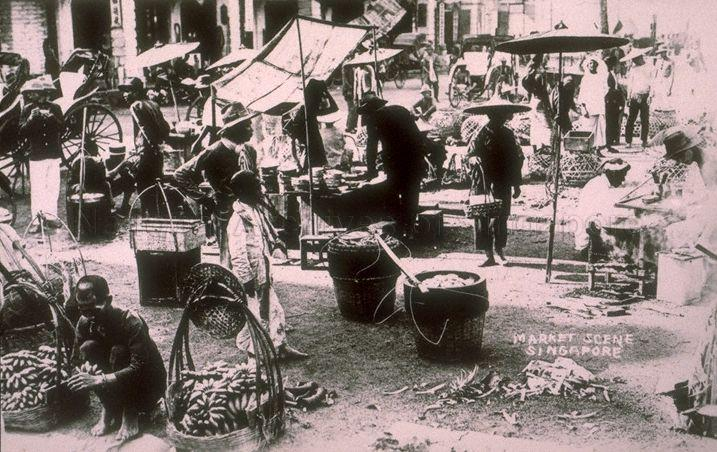
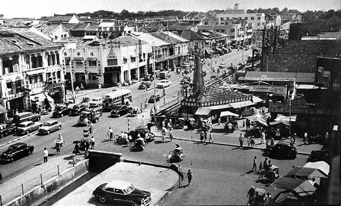
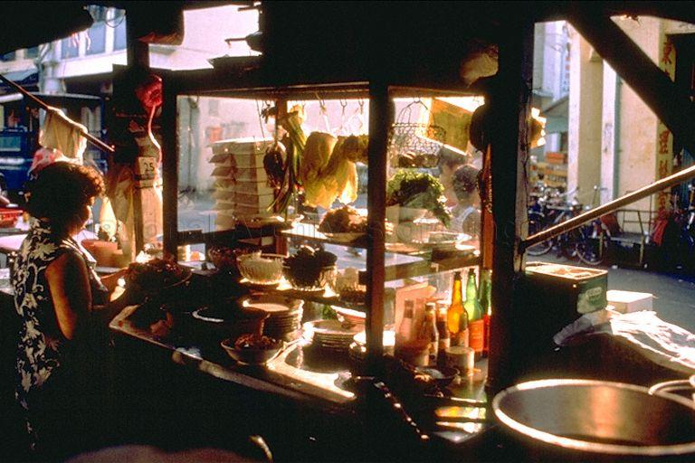
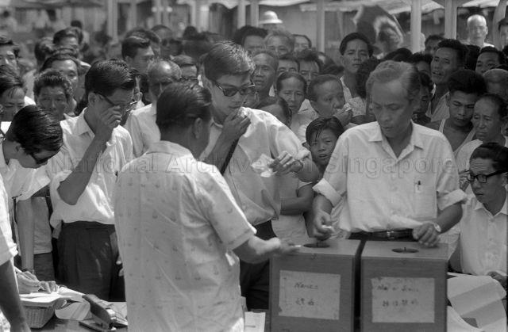
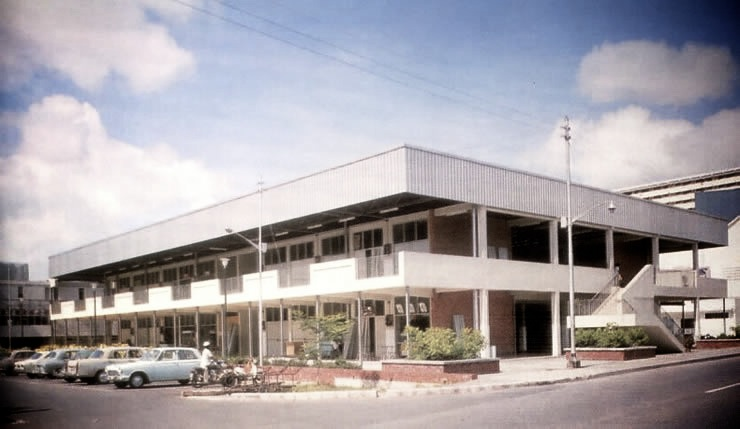
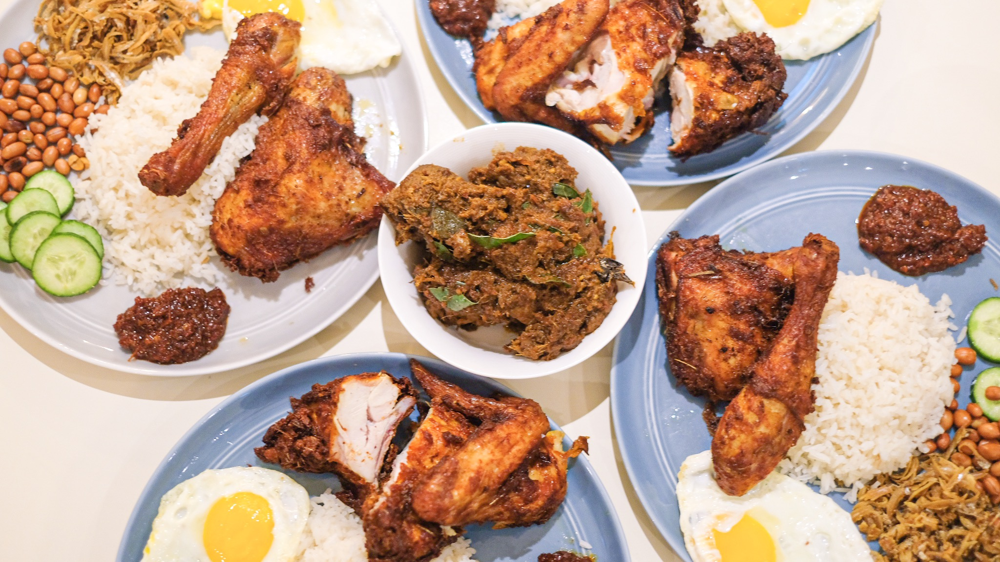

<style>
.html-widget {
    margin: auto;
}
</style>


<style>
p.caption {
  font-size: 1.0em;
}
</style>

<style type="text/css">

h1.title {
  font-size: 38px;
  text-align: center;
}
h4.author { /* Header 4 - and the author and data headers use this too  */
    font-size: 18px;
  text-align: center;
}
h4.date { /* Header 4 - and the author and data headers use this too  */
  font-size: 18px;
  text-align: center;
}
</style>

```{r setup, include=FALSE, warning=FALSE, message=FALSE}
library(ggmap)
library(googleway)
library(RCurl)
library(jsonlite)
library(tidyverse)
library(leaflet)
library(stringr)
library(NLP)
library(rvest)
library(lwgeom)
library(rgdal)
library(spdep)
library(prettydoc)
library(sf)
library(plotly)
library(RColorBrewer)
library(magick)
library(tmap)
library(lubridate)
library(gganimate)
library(png)
library(grid)
library(cowplot)
library(DT)
library(vembedr)

api_key<-"0"
register_google(key = api_key)
hawker_db<-read_csv("hawker_db.csv")
demerits_db<-read_csv("demerits_hawker.csv")
yr <- as.Date(as.character(hawker_db$year_constructed), format = "%Y")
y <- year(yr)
hawker_db$year_constructed<-y

# import maps and clean it
pop <- read_csv("resident20112019.csv")
mpsz = st_read(dsn="geospatial",layer = "MP14_SUBZONE_WEB_PL")
mpsz_pa_sf <- st_as_sf(mpsz[c("REGION_N", "PLN_AREA_N")])
mpsz_pa_sf <- st_set_crs(mpsz_pa_sf, 3414)
mpsz_pa_sf[rowSums(is.na(mpsz_pa_sf))!=0,]
mpsz_pa_sf <- st_make_valid(mpsz_pa_sf)
```

```{r, eval=FALSE, echo=FALSE, include=FALSE, warning=FALSE, message=FALSE}
# first get lat, long 
hawker_latlong <- geocode(location = hawker_db$location_of_centre, output = "more", source = "google")
hawker_db<-cbind(hawker_db,hawker_latlong[,1:2])


# Amend Golden Mile geographical info
hawker_db[15, 12] = 103.8639264
hawker_db[15, 13] = 1.3033328

hawker_db$location_of_centre<-gsub('\xe6',' ',hawker_db$location_of_centre)

# Place IDs
hawkerdb_list=list()
for(i in 1:107){
  res <- google_places(search_string = hawker_db$location_of_centre[i],
                    key = api_key,
                    radius = 500)
  ID<-res$results$place_id
  hawkerdb_list[[i]]<-ID
}

hawkerdb_list[[15]]="ChIJ04DTdbQZ2jERFt4kBQi-E60" 

hawker_placeid<-as.data.frame(unlist(hawkerdb_list))
hawker_db<-cbind(hawker_db,hawker_placeid)
names(hawker_db)[14]="place_id"

# Alternative place ID
hawker_db$colloquial_name<-gsub('\xe6',' ',hawker_db$colloquial_name)
hawkerdb_list2=list()

for(i in 1:107){
  res <- google_places(search_string = hawker_db$colloquial_name[i],
                    key = api_key,
                    radius = 500)
  ID<-res$results$place_id
  hawkerdb_list2[[i]]<-ID
}
hakwer_placeid2<- sapply(hawkerdb_list2, function(x) x[1])
hawker_placeid2<-as.data.frame(hakwer_placeid2)
hawker_db<-cbind(hawker_db,hawker_placeid2)
names(hawker_db)[15]="place_id2"


# then get rating
hawker_rating=list()
hawker_db$place_id2<-as.character(hawker_db$place_id2)

for(i in 1:107){
  res <- google_place_details(hawker_db$place_id2[i],
                    key = api_key)
  if(is.null(res)==FALSE){
    ratings<-res$result$rating
    hawker_rating[[i]]<-ratings
    print("success, rating recorded")
  }else{
    hawker_rating[[i]]<-"0"
    print("success but no entry found")
  }
}

hawker_ratings1<-setNames(do.call(rbind.data.frame, hawker_rating), c("ratings"))
hawker_db<-cbind(hawker_db,hawker_ratings1)


# then get number of ratings
hawker_noreviews=list()
hawker_db$place_id2<-as.character(hawker_db$place_id2)

for(i in 1:107){
  res <- google_place_details(hawker_db$place_id2[i],
                    key = api_key)
  if(is.null(res)==FALSE){
    noreviews<-res$result$user_ratings_total
    hawker_noreviews[[i]]<-noreviews
    print("success, ratings recorded")
  }else{
    hawker_noreviews[[i]]<-"0"
    print("success but no entry found")
  }
}

hawker_noratings1<-setNames(do.call(rbind.data.frame,hawker_noreviews), c("number_ratings"))
hawker_db<-cbind(hawker_db,hawker_noratings1)
# write.csv(hawker_db,"hawker_db.csv")
```

<center>

{width=50%}

</center>

The transformation of hawking culture from [“a public nuisance to be removed from the streets"](https://www.roots.gov.sg/stories-landing/stories/Serving-Up-a-Legacy) into a UNESCO Representative List of the Intangible Cutltural Heritage of Humanity is remarkable given the ground-up nature of its emergence as an integral part of our national identity. Practicality, survivalism and adaptation - a predictable if not bland *chapalang* of ingredients - have been the driving forces of change throughout the history of hawking culture in Singapore.

<center>



</center>

The hawker centre experience is simultaneously personal and communal. You know your favourite stalls, the various stall owners and in my case, the favourite corner where both sunlight and the flow of wind enters the market. Chances are that if you have resided in the same neighbourhood for most of your life, you would have seen through at least one stall from your childhood to your adulthood. It is also a semi-formal environment where a smile to the auntie serving you might garner you an additional portion of sweet and sour pork. 

The idea of hawker centres and wet markets has actually been around for quite awhile. The concept was first conceived of as a practical solution to improve public hygiene and health in the early 1900s. The then-Chief health officer for British India, Sir William John Ritchie Simpson, proposed for the creation of shelters for hawkers in 1907. While the idea was subsequently shelved due to cost considerations, it re-emerged in the 1920s and led to the building of [Singapore’s first few ‘hawker centres’ at Kreta Ayer (1921), People’s Park (1923), Carnie Street (1929), Queen Street (1929), Balestier Road (1929) and Lim Tua Tow Road (1935).](https://johorkaki.blogspot.com/2020/06/history-of-singapore-hawker-centre.html)

<center>



</center>

However, it was not until the rapid redevelopment of Singapore in the 1960s and 1970s that hawker centres became a critical feature of daily life. The video below depicts the construction of a new town and features markets as an amenity located at the heart of each township.  

<center>
```{r fig.align='center',echo=FALSE, warning=FALSE, message=FALSE}
embed_url("https://www.youtube.com/watch?v=-VosvrTlw7c&ab_channel=PrimeMinister%27sOffice%2CSingapore")
```
</center>

As more new towns developed, hawker centers and wet markets provided the government with an opportunity to solve two problems - first, it offered a politically viable relocation plan for street hawkers and second, it made it easier to enforce hygiene standards of hawkers. The hygiene issues associated with street hawking goes back decades and is extensively documented. A Hawkers Inquiry Commission was set up by Governor F. Gimson in 1950 to social, economic and health issues related to hawking in Singapore. The report itself acknowledged the extent of the problems caused by hawking, stating that *“[t]here is undeniably a disposition among officials [...] to regard the hawkers as primarily a public nuisance to be removed from the streets”*. Nonetheless, the issue was a political hot potato as street hawking provided employment and low-cost food options to large swathes of the electorate. 

<center>


</center>

With alternative sources of employment and strong economic growth by the early 1970s, the government decided to push full steam ahead with relocation plans for hawkers and the clamping down of illegal hawking. In 1974, the Hawker Department’s Special Squad was established and tasked by the Permanent Secretary (Environment) to clear all illegal hawkers within 18 months. This was achieved in 6 months. It is no surprise that hawker centres were constructed at breakneck pace across the island - some 54 hawker centres were built between 1974 and 1979 or about 11 hawker centres a year.

```{r, echo=FALSE, warning=FALSE, message=FALSE, fig.cap="Circular barchart of number of hawker centres and wet markets constructed by decades",fig.align="center"}

for (i in 1:107){
  distinct<-floor(hawker_db$year_constructed[i] / 10) * 10
  hawker_db$decade[i]<-distinct
}

hawker_years<-hawker_db %>% 
  group_by(decade) %>% 
  select(decade)%>%
  mutate(count = n())%>%
  distinct(decade,.keep_all = TRUE)

hawker_years[10, 2] = 0
hawker_years[10, 1] = 1930

# Make the plot
p <- ggplot(hawker_years, aes(x=as.factor(decade), y=count, fill=as.factor(decade))) + 
  geom_bar(stat="identity", alpha=0.5, show.legend = FALSE) +
  ylim(-100,120) +
  theme_minimal() +
  theme(
    axis.text = element_blank(),
    axis.title = element_blank(),
    panel.grid = element_blank(),
    plot.margin = unit(rep(-2,4), "cm")
  ) +
  coord_polar(start = 0) +
  geom_text(data=hawker_years, aes(x=as.factor(decade), y=count, label=decade), color="black", fontface="bold",alpha=0.6, size=2.5, inherit.aes = FALSE ) 

p+transition_reveal(decade)

```

Indeed, as seen in the diagram above, most if not all of the hawker centres we know today were built in the 1970s. Construction slowed in the 80s and virtually halted till the turn of the century. 

<center>



</center>

Inadvertently, the move to house street hawkers in a centralised locale surrounded by an entirely new estate town, birthed a novel subset of the evolving Singaporean cultural identity. The hawker centre now served as a literal cultural melting pot. It brought a new multi-ethnic dimension to our food, ending the hitherto ethnic-based locations, clientele and cuisine of street hawking. Once again, practicality incentivised innovation. As Lai Ah Eng notes in her paper *The Kopitiam in Singapore: An Evolving Story about Migration and Cultural Diversity*, the intensified competition of the hawker centre incentivised innovation, resulting in the creation of hybridised and multicultural menu items that we see today. 

For most, hawking offered a low barrier-to-entry form of employment. It is unsurprising that in the early years, stalls in newly-built hawker centres were hot-ticket items. In fact, balloting for a stall - like a HDB flat - was a rather big event. There were around 31 000 hawkers in Singapore back in 1973. [This booming hawker population was a cause for concern as it was seen as depriving other sectors of the economy from much-needed manpower. To discourage hawking as a means of employment, the government announced that licenses were to be prioritised for the disabled and those above 40.](https://eresources.nlb.gov.sg/newspapers/Digitised/Article/straitstimes19730427-1.2.8?ST=1&AT=search&SortBy=Oldest&k=build+new+hawker+centres&P=1&Display=0&filterS=0&QT=build,new,hawker,centres&oref=article)

<center>



</center>

Between 1986 and 2011, no new hawker centres were built while several were torn down without replacement. As early as 1983, concerns had been raised about the oversupply of stalls in hawker centres. This 25 year building hiatus meant that the hawker centre no longer featured as the nucleus of activity in new townships. Bukit Batok, Choa Chu Kang, Sengkang and Punggol did not have hawker centres. Newer townships such as Woodlands, Hougang and Punggol appear to have high population densities and low provision of hawker centres.

```{r, echo=FALSE, warning=FALSE, message=FALSE, fig.align="center"}
# Map with density
popdata2019 <- pop  %>%
  dplyr::filter(year == 2019) %>%
  group_by(planning_area, subzone, age_group) %>%
  summarise(`POP` = sum(resident_count)) %>%
  ungroup()%>%
  spread(age_group, POP)%>%
  mutate(`YOUNG` = rowSums(.[3:6])
        +rowSums(.[12])) %>%
  mutate(`ECONOMY ACTIVE` = rowSums(.[7:11])+rowSums(.[13:15])) %>%
  mutate(`AGED` = rowSums(.[16:21])) %>%
  mutate(`TOTAL` = rowSums(.[3:21])) %>%
  mutate(`DEPENDENCY` = (`YOUNG` + `AGED`)/`ECONOMY ACTIVE`) %>%
  select(`planning_area`, `subzone` , `TOTAL`)

popdata2019$subzone<-toupper(popdata2019$subzone)

mpsz_sub <- mpsz %>%
  select(SUBZONE_N, PLN_AREA_N, REGION_N)

mpszpop2019 <- merge(mpsz_sub, popdata2019, 
                      by.x = "SUBZONE_N", by.y = "subzone")

Total_Population <- mpszpop2019

# Dots with location of hawker centers
hawker_db_short<-hawker_db%>%
  select("colloquial_name","ratings","no_of_stalls","number_ratings","year_constructed","lat","lon")
hawkers <- st_as_sf(hawker_db_short, coords = c('lon', 'lat'), crs=4326)


tmap_mode("view")
tm <- 
  tm_shape(Total_Population)+ 
  tm_polygons("TOTAL", 
          palette = "Blues",
          popup.vars=c(
                  "Planning Area: "="PLN_AREA_N"),
          title = "Population",
          alpha = 1,
          n = 5,
          )+
  tm_borders(alpha = 0.5)+
  tm_view(set.zoom.limits = c(11,14))+
  tm_shape(hawkers)+
  tm_bubbles(col = "ratings", size="no_of_stalls",scale=0.5,
               border.col = "black", border.alpha = .5, 
               style="fixed", breaks=c(-Inf, seq(3, 5, by=0.5), 5),
               palette="Reds", contrast=1, 
               title.col="Google map ratings", id="name", 
               popup.vars=c("Name"="colloquial_name", "Year Constructed" = "year_constructed", "Ratings (Out of 5)"="ratings", "Number of ratings"="number_ratings","Number of stalls"="no_of_stalls"),
               popup.format=list())
    
    
lf <- tmap_leaflet(tm)

lf

```

The creation of hawker centres had, by that point in time, exhausted its purpose of rehousing street hawkers who were affected by urban redevelopment plans to more sanitary environments. Although there were calls for the building of new hawker centres and the upgrading of existing ones, the provision of this service was to be slowly transferred to private players. 

<center>


</center>

But by early 2001, there was a shift in government thinking on this issue. The then-acting Minister for the Environment Lim Swee Say recognised the role of the institution in Singapore social fabric. Indeed, it has become a must-visit pit stop for any wannabe parliamentarian in every election cycle. Subsequently, a $420 million Hawker Centre Upgrading Programme (HUP) was launched. By 2011, the government announced that it will build 10 new hawker centres. [A commitment was made to build another 10 in 2015’s budget.](https://www.todayonline.com/singapore/10-more-hawker-centres-be-built-within-12-years-grace-fu)  

<center>


</center>


These two developments played out in my neighbourhood with Mei Ling Market undergoing major renovation works and Commonwealth Market, located a stone’s throw from the Queenstown Library and Margaret Drive NTUC, being demolished. While the stalls that I frequented found new homes at Maxwell, Mei Ling and Redhill markets, it was nonetheless a sad to bid farewell to the physical manifestation of many fond childhood memories spent in the area. 

<center>



</center>

```{r, echo=FALSE, warning=FALSE, message=FALSE}
# Create age column
hawker_db$age<-2021-as.integer(hawker_db$year_constructed)
hawker_db$year_constructed<-as.integer(hawker_db$year_constructed)

age_rating <- ggplot(
  hawker_db, 
  aes(x = age, y=ratings)
  ) +
  geom_point(show.legend = FALSE, alpha = 0.7) +
  scale_color_viridis_d() +
  scale_size(range = c(2, 12)) +
  scale_x_log10() +
  labs(x = "Number of years since first constructed", y = "Google ratings")

age_rating<- plot_ly(
  hawker_db, x = ~age, y = ~ratings,
  color = ~age,
  text = ~paste("Name: ", colloquial_name,"<br>Age: ", age, '<br>Rating: ', ratings)
)

age_rating

```

Hawker centres are really quite popular institutions. No hawker centre or wet market received a rating of lesser than 3.7 on Google while the average was 4.07. The list of hawker centres ranked by their rating on Google maps can be found here: 

```{r, echo=FALSE, warning=FALSE, message=FALSE}
a<-hawker_db%>%
  select(colloquial_name,ratings)%>%
  arrange(desc(ratings))

datatable(a,
  caption = 'Ratings of hawker and wet markets in Singapore on Google'
)
```

Interestingly, there appears to be no strong associations between the year a market was first established and its popularity. This is likely due to the fact that famous stalls are likely to be evenly distributed due to relocation efforts and that more famous stalls have opened branches across the island. Additionally, given the HUP, there is likely to be equal standards of amenities across the various hawker centres. More details of each hawker centre and wet market can be found in the map below: 


```{r, echo=FALSE, warning=FALSE, message=FALSE, fig.align="center"}
# Map with density
popdata2019 <- pop  %>%
  dplyr::filter(year == 2019) %>%
  group_by(planning_area, subzone, age_group) %>%
  summarise(`POP` = sum(resident_count)) %>%
  ungroup()%>%
  spread(age_group, POP)%>%
  mutate(`YOUNG` = rowSums(.[3:6])
        +rowSums(.[12])) %>%
  mutate(`ECONOMY ACTIVE` = rowSums(.[7:11])+rowSums(.[13:15])) %>%
  mutate(`AGED` = rowSums(.[16:21])) %>%
  mutate(`TOTAL` = rowSums(.[3:21])) %>%
  mutate(`DEPENDENCY` = (`YOUNG` + `AGED`)/`ECONOMY ACTIVE`) %>%
  select(`planning_area`, `subzone` , `TOTAL`)

popdata2019$subzone<-toupper(popdata2019$subzone)

mpsz_sub <- mpsz %>%
  select(SUBZONE_N, PLN_AREA_N, REGION_N)

mpszpop2019 <- merge(mpsz_sub, popdata2019, 
                      by.x = "SUBZONE_N", by.y = "subzone")

Total_Population <- mpszpop2019

# Dots with location of hawker centers
hawker_db_short<-hawker_db%>%
  select("colloquial_name","ratings","no_of_stalls","number_ratings","year_constructed","lat","lon")
hawkers <- st_as_sf(hawker_db_short, coords = c('lon', 'lat'), crs=4326)


tmap_mode("view")
tm <- 
  tm_shape(Total_Population)+ 
  tm_polygons("TOTAL", 
          palette = "Blues",
          popup.vars=c(
                  "Planning Area: "="PLN_AREA_N"),
          title = "Population",
          alpha = 1,
          n = 5,
          )+
  tm_borders(alpha = 0.5)+
  tm_view(set.zoom.limits = c(11,14))+
  tm_shape(hawkers)+
  tm_bubbles(col = "ratings", size="no_of_stalls",scale=0.5,
               border.col = "black", border.alpha = .5, 
               style="fixed", breaks=c(-Inf, seq(3, 5, by=0.5), 5),
               palette="Reds", contrast=1, 
               title.col="Google map ratings", id="name", 
               popup.vars=c("Name"="colloquial_name", "Year Constructed" = "year_constructed", "Ratings (Out of 5)"="ratings", "Number of ratings"="number_ratings","Number of stalls"="no_of_stalls"),
               popup.format=list())
    
    
lf <- tmap_leaflet(tm)

lf

```

[As Associate Professor Joan Henderson writes in her op-ed on Channel News Asia, striking a fine balance between the practicality and tradition has been and will continue to be a formidable challenge](https://www.channelnewsasia.com/news/commentary/singapore-hawker-culture-unesco-listing-national-day-rally-10659748). The median age of a hawker in Singapore is currently 60. Although there are encouraging signs of more young hawkers joining the fold, there remains hurdles for new entrants. These include higher rents, long working hours as well as stiff price competition from existing stalls. The government has embarked on a social enterprise scheme - letting newer hawker centres be run independent of the National Environment Agency (NEA) - in an attempt to ensure the continued viability of hawker centres in Singapore. 

Only time will tell whether these initiatives will bear fruit. 

<center>

{width=60%}

</center>


