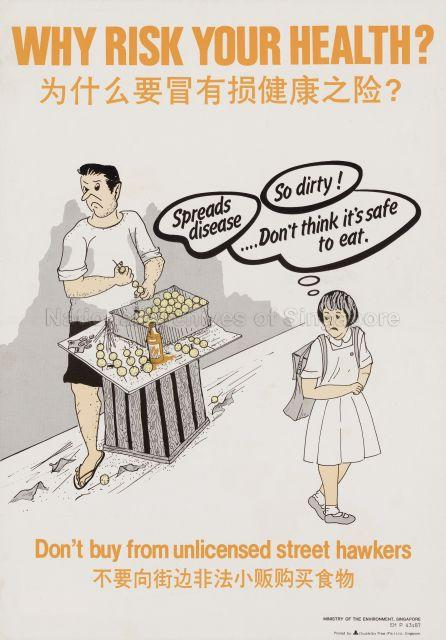

<style>
body {
text-align: justify}
</style>

<style>
.html-widget {
    margin: auto;
}
</style>


<style>
p.caption {
  font-size: 1.0em;
}
</style>

<style type="text/css">

h1.title {
  font-size: 38px;
  text-align: center;
}
h4.author { /* Header 4 - and the author and data headers use this too  */
    font-size: 18px;
  text-align: center;
}
h4.date { /* Header 4 - and the author and data headers use this too  */
  font-size: 18px;
  text-align: center;
}

h1, h2, h3 {
  text-align: center;
}

p.comment {
background-color: #DBDBDB;
padding: 10px;
border: 1px solid black;
margin-left: 25px;
border-radius: 5px;
font-style: italic;
}

</style>

```{r setup, include=FALSE, warning=FALSE, message=FALSE}
library(ggmap)
library(googleway)
library(RCurl)
library(jsonlite)
library(tidyverse)
library(leaflet)
library(stringr)
library(NLP)
library(rvest)
library(lwgeom)
library(rgdal)
library(spdep)
library(prettydoc)
library(sf)
library(plotly)
library(RColorBrewer)
library(magick)
library(tmap)
library(lubridate)
library(gganimate)
library(png)
library(grid)
library(cowplot)
library(DT)
library(vembedr)
library(metathis)
library(knitr)

api_key<-"0"
register_google(key = api_key)
hawker_db<-read_csv("hawker_db.csv")
demerits_db<-read_csv("demerits_hawker.csv")
yr <- as.Date(as.character(hawker_db$year_constructed), format = "%Y")
y <- year(yr)
hawker_db$year_constructed<-y

# import maps and clean it
pop <- read_csv("resident20112019.csv")
mpsz = st_read(dsn="geospatial",layer = "MP14_SUBZONE_WEB_PL")
mpsz_pa_sf <- st_as_sf(mpsz[c("REGION_N", "PLN_AREA_N")])
mpsz_pa_sf <- st_set_crs(mpsz_pa_sf, 3414)
mpsz_pa_sf[rowSums(is.na(mpsz_pa_sf))!=0,]
mpsz_pa_sf <- st_make_valid(mpsz_pa_sf)
```

```{r, echo=FALSE}
meta() %>%
  meta_description(
    "What began as an attempt at regulating and disciplining the unruliness of urban life engendered the right conditions for the  emergence and evolution of hawker food into an integral part of our national identity. So how did this happen?"
  ) %>% 
  meta_viewport() %>% 
  meta_social(
    title = "From side streets to UNESCO hawker centres: Visualising the evolution of hawking in Singapore",
    url = "https://kyiyeunggoh.github.io/Other%20Projects/SG%20Hawkers/sg_hawkers.html",
    image = "https://kyiyeunggoh.github.io/Other%20Projects/SG%20Hawkers/photos/hawker_ets_1970.jpg",
    image_alt = "A hawker centre at Eu Tong Sen in 1970. Source: National Archives of Singapore",
    og_author = c("Kyi Yeung Goh"),
    twitter_card_type = "summary",
    twitter_creator = "@kyigoh"
  )
```


```{r, eval=FALSE, echo=FALSE, include=FALSE, warning=FALSE, message=FALSE}
# first get lat, long 
hawker_latlong <- geocode(location = hawker_db$location_of_centre, output = "more", source = "google")
hawker_db<-cbind(hawker_db,hawker_latlong[,1:2])


# Amend Golden Mile geographical info
hawker_db[15, 12] = 103.8639264
hawker_db[15, 13] = 1.3033328

hawker_db$location_of_centre<-gsub('\xe6',' ',hawker_db$location_of_centre)

# Place IDs
hawkerdb_list=list()
for(i in 1:107){
  res <- google_places(search_string = hawker_db$location_of_centre[i],
                    key = api_key,
                    radius = 500)
  ID<-res$results$place_id
  hawkerdb_list[[i]]<-ID
}

hawkerdb_list[[15]]="ChIJ04DTdbQZ2jERFt4kBQi-E60" 

hawker_placeid<-as.data.frame(unlist(hawkerdb_list))
hawker_db<-cbind(hawker_db,hawker_placeid)
names(hawker_db)[14]="place_id"

# Alternative place ID
hawker_db$colloquial_name<-gsub('\xe6',' ',hawker_db$colloquial_name)
hawkerdb_list2=list()

for(i in 1:107){
  res <- google_places(search_string = hawker_db$colloquial_name[i],
                    key = api_key,
                    radius = 500)
  ID<-res$results$place_id
  hawkerdb_list2[[i]]<-ID
}
hakwer_placeid2<- sapply(hawkerdb_list2, function(x) x[1])
hawker_placeid2<-as.data.frame(hakwer_placeid2)
hawker_db<-cbind(hawker_db,hawker_placeid2)
names(hawker_db)[15]="place_id2"


# then get rating
hawker_rating=list()
hawker_db$place_id2<-as.character(hawker_db$place_id2)

for(i in 1:107){
  res <- google_place_details(hawker_db$place_id2[i],
                    key = api_key)
  if(is.null(res)==FALSE){
    ratings<-res$result$rating
    hawker_rating[[i]]<-ratings
    print("success, rating recorded")
  }else{
    hawker_rating[[i]]<-"0"
    print("success but no entry found")
  }
}

hawker_ratings1<-setNames(do.call(rbind.data.frame, hawker_rating), c("ratings"))
hawker_db<-cbind(hawker_db,hawker_ratings1)


# then get number of ratings
hawker_noreviews=list()
hawker_db$place_id2<-as.character(hawker_db$place_id2)

for(i in 1:107){
  res <- google_place_details(hawker_db$place_id2[i],
                    key = api_key)
  if(is.null(res)==FALSE){
    noreviews<-res$result$user_ratings_total
    hawker_noreviews[[i]]<-noreviews
    print("success, ratings recorded")
  }else{
    hawker_noreviews[[i]]<-"0"
    print("success but no entry found")
  }
}

hawker_noratings1<-setNames(do.call(rbind.data.frame,hawker_noreviews), c("number_ratings"))
hawker_db<-cbind(hawker_db,hawker_noratings1)
# write.csv(hawker_db,"hawker_db.csv")
```

<center>

{width=50%}

</center>

Hawker culture has undergone a remarkable transformation from [“a public nuisance to be removed from the streets”](https://www.roots.gov.sg/stories-landing/stories/Serving-Up-a-Legacy) to an entry on the UNESCO Representative List of the Intangible Cultural Heritage of Humanity. Its reformation and subsequent co-optation into our nation's broader developmental narrative is a tale as complex and saucy as the broth of a bowl of *Mee Rebus*. 

What began as an attempt at regulating and disciplining the unruliness of urban life engendered the right conditions for the  emergence and evolution of hawker food as an integral part of our national identity. So how did this happen? We need to begin by understanding that the hawker centres we know of today were neither the logical nor natural successors to the street hawkers of yesteryears. 

<center>


</center>

Everyone’s hawker centre experience is simultaneously personal and communal. You know your favourite stalls and their various stall owners. In my case, I have a favourite corner where both sunlight and the flow of wind enter the market. Chances are that if you have resided in the same neighbourhood for most of your life, you would have seen at least one stall through from your childhood to your adulthood. It is also a semi-formal environment where a smile at the auntie serving you might garner you an additional portion of sweet and sour pork.

The idea of hawker centres and wet markets has a longer history than we might expect. The concept was first conceived of as a practical solution to improve public hygiene and health in the early 1900s. The then-Chief health officer for British India, Sir William John Ritchie Simpson, proposed the creation of shelters for hawkers in 1907. While the idea was subsequently shelved due to cost considerations, it re-emerged in the 1920s and led to the building of [Singapore’s first few ‘hawker centres’ at Kreta Ayer (1921), People’s Park (1923), Carnie Street (1929), Queen Street (1929), Balestier Road (1929) and Lim Tua Tow Road (1935).](https://johorkaki.blogspot.com/2020/06/history-of-singapore-hawker-centre.html)

<center>


</center>


<center>


</center>

However, it was not until the rapid redevelopment of Singapore in the 1960s and 1970s that hawker centres became a staple feature of daily life. The video below depicts how markets featured as an amenity located at the heart of each new town.

<center>
```{r fig.align='center',echo=FALSE, warning=FALSE, message=FALSE}
embed_url("https://www.youtube.com/watch?v=-VosvrTlw7c&ab_channel=PrimeMinister%27sOffice%2CSingapore")
```
</center>

## The unfortunate consumer dilemma: hygiene or hunger? 

As more new towns developed, hawker centres and wet markets provided the government with an opportunity to solve two problems - first, they offered a politically viable relocation plan for street hawkers; and second, they made it easier to enforce hygiene standards on hawkers. The hygiene issues associated with street hawking go back decades and are extensively documented. A Hawkers Inquiry Commission was set up by Governor F. Gimson in 1950 to address the social, economic, and health issues related to hawking in Singapore.

>The report itself acknowledged the extent of the problems caused by hawking, stating that *“[t]here is undeniably a disposition among officials [...] to regard the hawkers as primarily a public nuisance to be removed from the streets”*. 

Everyday workers recognised the problems and in most cases, came up with practical workarounds to avoid suffering from a terrible bout of food poisoning. In an interview with the Oral History Centre, Mr. Vincent Gabriel recounts how he purposefully shifted meal times to avoid having spoilt ingredients in his meal.

>Once, he ordered a bowl of laksa only to suspect that the coconut milk had gone sour. To avoid a confrontation with the hawker, he just postponed the meal to the next day. 

In fact, he acknowledges the public health threat posed by street hawking. He notes how outbreaks of cholera, dysentery and other water-borne diseases occurred as a result of unsanitary food environments.

<center>


</center>

What then was the appeal of a hawker meal to Vincent? Simple. 

>"The idea was to just give you alot of food, and the prices were quite low."  

Sounds familiar? 

This tale of spoilt coconut milk does, however, emblematise the spirit of those times – every family unit was, in their own ways, improvising to make ends meet and simply did not have time to entertain unnecessary drama. Indeed, Vincent notes how hawker food was a compromise as people had to work long hours and simply did not have the luxury of time to prepare and enjoy a home-cooked meal. The story also points to the rapid industrialisation of 1970s which greatly altered the economic roles of women in Singapore.  [Between 1957 and 1975, the female labour force participation rate almost doubled from 21.6 to 35.2 percent.](https://www.jstor.org/stable/29769892) **Eating out was therefore viewed as a compromise to home-cooked meals.**

It was evident that any resolution to the issue of street hawking would require a potentially large investment of political capital as it not only provided employment to many but also offered low-cost food options to large swathes of the electorate.

<center>


</center>

## Construction and clean-up

With alternative sources of employment and strong economic growth by the early 1970s, the government decided to go full steam ahead to relocate hawkers and clamp down on illegal hawking. In 1974, the Hawker Department’s Special Squad was established and tasked by the Permanent Secretary (Environment) to clear all illegal hawkers within 18 months. This was achieved in 6. 

While the government continued to clamp down on illegal hawking, it also worked to minimise the frictions associated with mass relocation.  They recognised the need to build hawker centres, fast. 

Some 54 hawker centres were built between 1974 and 1979, or about 11 hawker centres a year. Indeed, as seen in the diagram below, most if not all of the hawker centres we know today were built in the 1970s. Construction slowed in the 1980s and virtually halted till the turn of the century. **(More on why later on!)**

```{r, echo=FALSE, warning=FALSE, message=FALSE, fig.cap="Circular barchart of number of hawker centres and wet markets constructed by decades",fig.align="center",out.width="150%"}

for (i in 1:107){
  distinct<-floor(hawker_db$year_constructed[i] / 10) * 10
  hawker_db$decade[i]<-distinct
}

hawker_years<-hawker_db %>% 
  group_by(decade) %>% 
  select(decade)%>%
  mutate(count = n())%>%
  distinct(decade,.keep_all = TRUE)

hawker_years[10, 2] = 0
hawker_years[10, 1] = 1930

# Make the plot
p <- ggplot(hawker_years, aes(x=as.factor(decade), y=count, fill=as.factor(decade))) + 
  geom_bar(stat="identity", alpha=0.5, show.legend = FALSE) +
  ylim(-100,120) +
  theme_minimal() +
  theme(
    axis.text = element_blank(),
    axis.title = element_blank(),
    panel.grid = element_blank(),
    plot.margin = unit(rep(-2,4), "cm")
  ) +
  coord_polar(start = 0) +
  geom_text(data=hawker_years, aes(x=as.factor(decade), y=count, label=decade), color="black", fontface="bold",alpha=0.6, size=2.5, inherit.aes = FALSE ) 

p+transition_reveal(decade)

```

```{r, echo=FALSE,out.width="49%", out.height="20%",fig.cap="[Clockwise] Tiong Bahru Market (built in the 1950s), Tanglin Halt Market (built in the 1960s), Geylang Bahru Market (built in the 1970s) and Maxwell Market (built in the 1980s). Sources: Tiong Bahru Estate Facebook page, My Queenstown, Singapore Memory Project and National Archives of Singapore",fig.show='hold',fig.align='center'}

knitr::include_graphics(c("photos/coconuts_tbpestate_market.jpg","photos/myqueenstown_tanglinhalt.jpg","photos/geylangbahrumarket.jpeg","photos/maxwell_last.jpg"))

```

<center>


</center>

## Adaptation, survivalism and practicality

Inadvertently, the move to centralise street hawkers within entirely new towns and in the lives of each town’s inhabitants cemented the hawker centre’s prime position in the evolving Singaporean cultural identity. The hawker centre now served as a literal cultural melting pot. It brought a new multi-ethnic dimension to our food, ending the hitherto ethnically-based locations, clientele, and cuisine of street hawking. Once again, practicality incentivised innovation. As Lai Ah Eng notes in her paper *The Kopitiam in Singapore: An Evolving Story about Migration and Cultural Diversity*, the intensified competition of the hawker centre incentivised innovation, resulting in the creation of hybridised and multicultural menu items that we see today.

<div class="alert alert-info">
  <strong>The tale of the mysterious *Rochor mee* and humble *Bak Kut Teh*:</strong> An aside into the emergence of beloved national dishes
</div>


<center>


</center>


<p class="comment"> In some sense hawking’s evolution as an artform found its roots in particularly harsh and tumultuous soil. In a later part of the interview mentioned earlier as part of the spoilt coconut milk story, Vincent recalls the creation of a mysterious yet famous *Rochor mee*. I was confused. Was I missing something? *Simi lai eh?* Last I checked, hawker centres across Singapore were not selling a dish called *Rochor mee*. He describes this noodle dish as being a by-product of entrepreneurial hawkers that wanted to make use of leftovers to make more money. Back in the 1960s, Rochor Market was known for its pork products. Not wanting to let the leftovers - pork belly, spare parts and lard - go to waste, hawkers would purchase them and stir-fry it with noodles in a broth made out of leftover prawn shells. This cacophony of flavours generated from leftovers turned out to be a hit. Over time, the name *Rochor mee* gave way to the *Hokkien mee* we know today. Now, this partially explains why our Hokkien mee is so different from the Malaysian variant.
In his interview, Vincent also alludes to the intensified competition that Lai notes in her paper. He remarks how rehousing in markets meant that consumers could now simply hop from one stall to another, often selecting the stall that had better quality food at a slight premium. This competition meant that cheap fish used to make fish cakes was soon replaced with others such as *ang ko li* (red snapper). Some went out of business due to competition while others with better products flourished.</p>

<center>


</center>

<p class="comment"> Another accidental creation was that of Bak Kut Teh. [The ever-amazing *Johorkaki* blog (in a story that primarily focuses on the now-disappeared Pulau Saigon at Boat Quay) notes how poor coolies would make use of the discarded meat and bones from the Pulau Saigon Abattoir to make a soup conconction.](https://johorkaki.blogspot.com/2020/07/history-pulau-saigon-singapore-river-bak-kut-teh.html#:~:text=The%20concoction%20was%20probably%20devised,opening%20of%20Pulau%20Saigon%20Abattoir.) To the meat parts and bones, they would add Chinese herbs and dark soy sauce. Hence, it is said that this now-ubiquitous dish was created around the 1880s with the opening of an abattoir near Boat Quay.</p>

While hawking was clearly labour-intensive, competitive and in some cases, downright dangerous due to harrassment from gangs, it nonetheless offered a low barrier-to-entry means to eke out a living and work up the social ladder. The lax enforcement of public health standards and minimal supervision of hawking meant that most hawkers were often operating without a license. Stands would pop up and even disappear overnight. In an [interview with the National Archives](https://www.nas.gov.sg/archivesonline/oral_history_interviews/record-details/705687a4-115f-11e3-83d5-0050568939ad?keywords=life%20as%20hawker&keywords-type=all), a rojak hawker by the name of Mr. Lim recalls having to start preparation for his cuttlefish the evening before in order to have it ready by the following afternoon. 

>> An uncharacteristically candid moment is recorded on the tape when the interviewer audibly gasps at Mr. Lim's remarks that he did this backbreaking work 7 days a week without rest. 

Towards the end of the tape, he notes that he eventually moved out of the hawking business into a managerial role at a local theatre.

It is thus unsurprising that in earlier years, stalls in newly-built hawker centres were hot-ticket items. In fact, balloting for a stall - much like a prized HDB flat back then - was a rather big event. Balloting ceremonies would often be attended by throngs of crowds and officiated by a member of government.

<center>


</center>

There were just over 31,000 hawkers in Singapore back in 1973. [This booming hawker population was a cause for concern as it was seen as depriving other sectors of the economy from much-needed manpower. To discourage hawking as a means of employment, the government announced that licenses were to be prioritised for the disabled and those above 40.](https://eresources.nlb.gov.sg/newspapers/Digitised/Article/straitstimes19730427-1.2.8?ST=1&AT=search&SortBy=Oldest&k=build+new+hawker+centres&P=1&Display=0&filterS=0&QT=build,new,hawker,centres&oref=article)

## Upturn the downturn

The construction of hawker centres and other market-related facilities ground to a sharp halt by the 1980s. Returning to the earlier circular barchart, we note a significant decline in the height of the bar after the 1970s. By 1983, concerns had been raised regarding the oversupply of stalls in hawker centres – [a Hawker’s Department official stated that there was no need to build more hawker centres as the ones slated for construction more than met the need for rehousing street vendors](https://eresources.nlb.gov.sg/newspapers/Digitised/Article/singmonitor19830429-1.2.10.1?ST=1&AT=search&k=build%20new%20hawker%20centres&QT=build,new,hawker,centres&oref=article). Indeed, between 1986 and 2011, no new hawker centres were built while several were torn down without replacement.

**As seen below, this 25-year building hiatus meant that the hawker centre no longer featured as the nucleus of activity in new townships.** Bukit Batok, Choa Chu Kang, Sengkang, and Punggol did not have hawker centres. Newer townships such as Woodlands, Hougang, and Punggol appear to have high population densities and a low provision of hawker centres.

In a [Straits Times piece](https://www.straitstimes.com/singapore/less-kampung-spirit-and-vibrancy-in-newer-towns) about the lack of the *kampung spirit* in new towns, experts point to the lack of hawker centres and street-level shops in these neighbourhoods as the cause of this malaise. The planning of yesteryears had featured hawker centres and wetmarkets as the heart of communal interaction. The routine of marketing and eating at hawker centre provided a key ingredient in the formation of personal relationships. A quote from the article highlights this very point. 

> "When you eat at a hawker centre, you watch your neighbours go by and say hello or nod your head. You make friends with your favourite hawker," said lifelong Bukit Merah resident and business development manager Desiree Teoh, 34.

> "These little actions add up and, over time, you feel grounded to a place," she added.

As noted by the same article, one reason for this discrepancy could have been the occupancy rates of new estates. Staggered provision of such markets – two new markets are slated to be built in Punggol by 2027 – could be timed to keep pace with the size of the estates.

### Interactive graphic plotting location of hawker centres and wet markets as of 2016 across Singapore with colour gradient for subzone population in 2019

```{r, echo=FALSE, warning=FALSE, message=FALSE, fig.align="center", fig.cap="Location of hawker centers and wet markets as of 2016 across Singapore with colour gradient for subzone population in 2019"}
# Map with density
popdata2019 <- pop  %>%
  dplyr::filter(year == 2019) %>%
  group_by(planning_area, subzone, age_group) %>%
  summarise(`POP` = sum(resident_count)) %>%
  ungroup()%>%
  spread(age_group, POP)%>%
  mutate(`YOUNG` = rowSums(.[3:6])
        +rowSums(.[12])) %>%
  mutate(`ECONOMY ACTIVE` = rowSums(.[7:11])+rowSums(.[13:15])) %>%
  mutate(`AGED` = rowSums(.[16:21])) %>%
  mutate(`TOTAL` = rowSums(.[3:21])) %>%
  mutate(`DEPENDENCY` = (`YOUNG` + `AGED`)/`ECONOMY ACTIVE`) %>%
  select(`planning_area`, `subzone` , `TOTAL`)

popdata2019$subzone<-toupper(popdata2019$subzone)

mpsz_sub <- mpsz %>%
  select(SUBZONE_N, PLN_AREA_N, REGION_N)

mpszpop2019 <- merge(mpsz_sub, popdata2019, 
                      by.x = "SUBZONE_N", by.y = "subzone")

Total_Population <- mpszpop2019

# Dots with location of hawker centers
hawker_db_short<-hawker_db%>%
  select("colloquial_name","year_constructed","lat","lon")
hawkers <- st_as_sf(hawker_db_short, coords = c('lon', 'lat'), crs=4326)


tmap_mode("view")
tm <- 
  tm_shape(Total_Population)+ 
  tm_polygons("TOTAL", 
          palette = "Reds",
          popup.vars=c(
                  "Planning Area: "="PLN_AREA_N"),
          title = "Population",
          alpha = 1,
          n = 5,
          )+
  tm_borders(alpha = 0.5)+
  tm_view(set.zoom.limits = c(11,14))+
  tm_shape(hawkers)+
  tm_bubbles(size=0.05,col="orange",border.col = "black", border.alpha = .5, 
               style="fixed",
               palette="Reds", contrast=1,id="name", 
               popup.vars=c("Name"="colloquial_name", "Year Constructed" = "year_constructed"),
               popup.format=list())
    
    
lf <- tmap_leaflet(tm)

lf

```

The creation of hawker centres had by 1986 exhausted its then purpose of rehousing street hawkers affected by urban redevelopment plans in more sanitary environments. Although there were calls for the building of new hawker centres and the upgrading of existing ones, the provision of this service was to be slowly transferred to private players.

<center>



</center>

However, by early 2001 there was a subtle shift in government thinking on this issue. Then acting Minister for the Environment Lim Swee Say recognised the role of the institution in Singapore’s social fabric. Indeed, it has become a must-visit pit stop for any wannabe parliamentarian in every election cycle. Safe to say, you would probably have chanced upon a picture of a stallholder with the constituency’s Member of Parliament emblazoned on his or her stall front at some point. Consequently, a $420 million Hawker Centre Upgrading Programme (HUP) was launched.

Yet, the end to the two-decade long paucity in the building of new hawker centres would have to wait until 2011. In October 2011, after the general election, the government announced that it would build 10 new hawker centres citing social trends and public feedback. [A commitment was made to build another 10 in 2015’s budget.](https://www.todayonline.com/singapore/10-more-hawker-centres-be-built-within-12-years-grace-fu)  


> Then Minister for Environment and Water Resources Vivian Balakrishnan noted that the government had "realised, increasingly more Singaporeans are eating out rather than cooking at home". 

<center>


</center>

<center>


</center>

These two developments played out in my neighbourhood with Mei Ling Market undergoing major renovation works and Commonwealth Market, located a stone’s throw from the Queenstown Library and the Margaret Drive NTUC, being demolished. While the stalls that I frequented found new homes at Maxwell, Mei Ling and Redhill markets, it was nonetheless sad to bid farewell to the physical manifestation of many fond childhood memories spent in the area. 

<center>


</center>

<div class="alert alert-info">
  <strong>Another aside:</strong> *Does heritage have anything to do with how popular hawker centres are? A look at Google ratings of places.* 
</div>

```{r, echo=FALSE, warning=FALSE, message=FALSE}
# Create age column
hawker_db$age<-2021-as.integer(hawker_db$year_constructed)
hawker_db$year_constructed<-as.integer(hawker_db$year_constructed)

age_rating <- ggplot(
  hawker_db, 
  aes(x = age, y=ratings)
  ) +
  geom_point(show.legend = FALSE, alpha = 0.7) +
  scale_color_viridis_d() +
  scale_size(range = c(2, 12)) +
  scale_x_log10() +
  labs(x = "Number of years since first constructed", y = "Google ratings")

age_rating<- plot_ly(
  hawker_db, x = ~age, y = ~ratings,
  color = ~age,
  text = ~paste("Name: ", colloquial_name,"<br>Age: ", age, '<br>Rating: ', ratings)
)

age_rating

```

<p class="comment">
Hawker centres are really quite popular institutions. No hawker centre or wet market received a rating of lesser than 3.70 on Google while the average was 4.07. The list of hawker centres ranked by their rating on Google maps can be found here:</p>

```{r, echo=FALSE, warning=FALSE, message=FALSE}
a<-hawker_db%>%
  select(colloquial_name,ratings)%>%
  arrange(desc(ratings))

datatable(a,
  caption = 'Ratings of hawker and wet markets in Singapore on Google'
)
```

<p class="comment"> Interestingly, there appears to be no strong association between the year a market was first established and its popularity. This is likely due to the fact that famous stalls are probably evenly distributed due to relocation efforts and that more famous stalls have opened branches across the island. Franchising of famous hawker stalls have also occured, allowing residents on other parts of the island to eat something from Tiong Bahru. Additionally, given the HUP, there is likely to be equal standards of amenities across the various hawker centres. More details of each hawker centre and wet market can be found in the map below:</p>


```{r, echo=FALSE, warning=FALSE, message=FALSE, fig.align="center", fig.cap="Location of hawker centres and wet markets (with additional market metadata) as of 2016 across Singapore"}
# Map with density
popdata2019 <- pop  %>%
  dplyr::filter(year == 2019) %>%
  group_by(planning_area, subzone, age_group) %>%
  summarise(`POP` = sum(resident_count)) %>%
  ungroup()%>%
  spread(age_group, POP)%>%
  mutate(`YOUNG` = rowSums(.[3:6])
        +rowSums(.[12])) %>%
  mutate(`ECONOMY ACTIVE` = rowSums(.[7:11])+rowSums(.[13:15])) %>%
  mutate(`AGED` = rowSums(.[16:21])) %>%
  mutate(`TOTAL` = rowSums(.[3:21])) %>%
  mutate(`DEPENDENCY` = (`YOUNG` + `AGED`)/`ECONOMY ACTIVE`) %>%
  select(`planning_area`, `subzone` , `TOTAL`)

popdata2019$subzone<-toupper(popdata2019$subzone)

mpsz_sub <- mpsz %>%
  select(SUBZONE_N, PLN_AREA_N, REGION_N)

mpszpop2019 <- merge(mpsz_sub, popdata2019, 
                      by.x = "SUBZONE_N", by.y = "subzone")

Total_Population <- mpszpop2019

# Dots with location of hawker centers
hawker_db_short<-hawker_db%>%
  select("colloquial_name","ratings","no_of_stalls","number_ratings","year_constructed","lat","lon")
hawkers <- st_as_sf(hawker_db_short, coords = c('lon', 'lat'), crs=4326)


tmap_mode("view")
tm <- 
  tm_shape(Total_Population)+ 
  tm_borders(alpha = 0.5)+
  tm_view(set.zoom.limits = c(11,14))+
  tm_shape(hawkers)+
  tm_bubbles(size=0.6,col = "ratings",scale=0.5,
               border.col = "black", border.alpha = .5, 
               style="fixed", breaks=c(-Inf, seq(3.5, 5, by=0.5), 5),
               palette="Reds", contrast=1, 
               title.col="Google map ratings", id="name", 
               popup.vars=c("Name"="colloquial_name", "Year Constructed" = "year_constructed", "Ratings (Out of 5)"="ratings", "Number of ratings"="number_ratings","Number of stalls"="no_of_stalls"),
               popup.format=list())
    
    
lf <- tmap_leaflet(tm)

lf

```

## From hawk to gawk?

[As Associate Professor Joan Henderson writes in her op-ed on Channel News Asia, striking a fine balance between the practicality and tradition has been and will continue to be a formidable challenge for hawking culture in Singapore.](https://www.channelnewsasia.com/news/commentary/singapore-hawker-culture-unesco-listing-national-day-rally-10659748)

> Perhaps as a result of better education and opportunities for the younger generation, the median age of hawkers in Singapore is currently 59 years old. 

A new breed of “hipster hawkers” has entered the hawker industry – they are either continuing the business of their parents with some modern twists or are starting afresh with new offerings that appeal to younger crowds. These include offerings like tacos, donburis, and specialty coffee. Others have brought hawker food into more upscale settings such as the Coconut Club along Ann Siang Road. Although these are encouraging signs of more young hawkers joining the fold, there remain hurdles for new entrants. These include higher rents, long working hours, as well as stiff price competition from existing stalls. The government has embarked on a social enterprise scheme – letting newer hawker centres run independently of the National Environment Agency (NEA) – in an attempt to ensure the continued viability of hawker centres in Singapore. Only time will tell whether these initiatives will bear fruit.

<center>

{width=60%}

</center>

Hawking has been inextricably linked with Singapore’s developmental story. Its transformation from a profession whose existence was regarded as part of an uneasy social compromise into a provider of a key component of our national identity – food – was neither inevitable nor natural. The UNESCO nod does justice to the incredible journey of hawkers in Singapore - a journey characterised by remarkable grit, unusual innovation, and skilful adaptation. 


**Data Sources:**

* For the database of hawker information, data from NEA's [*List of Government Markets*](https://data.gov.sg/dataset/list-of-government-markets-hawker-centres) and Google's on-demand Places and Geolocation API were combined. This combined database for hawker centres and wet markets used to generate the above piece can be found here downloaded off my [Github](https://github.com/kyiyeunggoh/kyiyeunggoh.github.io/blob/master/Other%20Projects/SG%20Hawkers/hawker_db.csv).

* For the population information and interactive map, a database was created using [the Ministry of Trade and Industry's Department of Statistics' Singapore Residents by Subzone and Type of Dwelling, 2011 - 2019 data]( ghttps://data.gov.sg/dataset/singapore-residents-by-subzone-and-type-of-dwelling-2011-2019) along with the [Urban Redevelopment Authority's (URA) geoJSON shape files](https://data.gov.sg/dataset/master-plan-2014-subzone-boundary-web).

* Interviews were sourced from the National Archive's online repository.